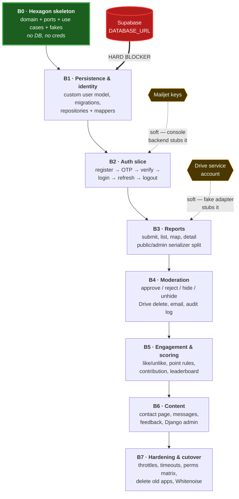
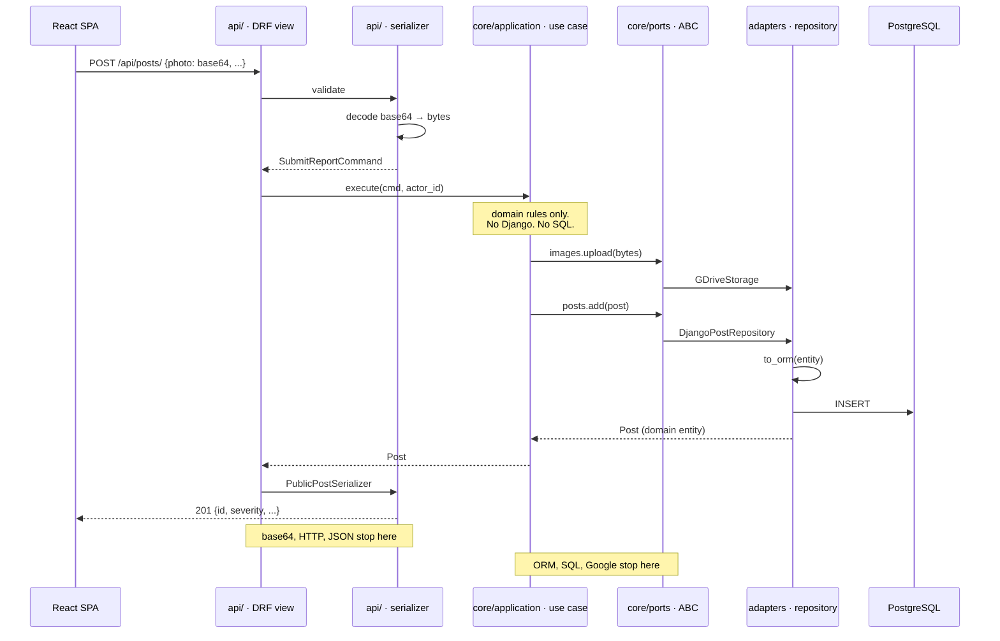
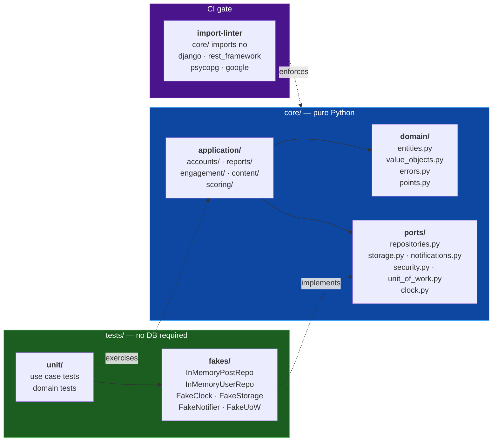
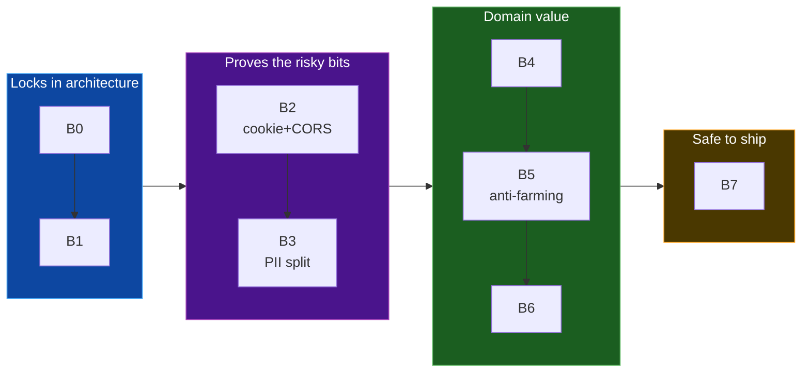

# Backend Implementation Plan

**Branch:** `backend`
**Companion to:** `backend_lld.md` (the *what*). This document is the *order*.
**Status:** Ready to start B0.

> Preview this file in VS Code (`Cmd+Shift+V`) to render the diagrams.

---

## 1. The shape of the plan

Eight milestones. The first is unblocked today; the rest gate on one credential each.



**Only the database truly blocks.** Mailjet and Drive sit behind ports (`Notifier`, `ImageStorage`),
so fake adapters carry B2–B6 and the real ones drop in whenever keys arrive. That is the port design
paying rent, not a workaround.

---

## 2. What "done" looks like — the target request flow

Every milestone from B2 onward adds one vertical slice through these layers. Nothing skips a layer.



The two `Note` boxes are the whole architecture. Transport concerns die at the serializer; infrastructure
concerns die at the port. `core/` sees neither.

---

## 3. B0 in detail — starting now

B0 builds the hexagon and nothing else. No Django settings changes, no migrations, no `pip install`
beyond dev tooling.



### B0 task list

| # | Task |
|---|---|
| 1 | Create `core/`, `adapters/`, `api/`, `config/` skeleton alongside the existing apps (old apps untouched until B7) |
| 2 | `core/domain/value_objects.py` — `Severity`, `PostStatus`, `EngagementType`, `Role`, `Reporter`, `GeoPoint`, `ImageRef` |
| 3 | `core/domain/entities.py` — `User`, `Post`, `Engagement`, `PointRule`, `LevelRule`, `Feedback`, `ContactMessage`, `ContactPage`, `PostModerationLog` |
| 4 | `core/domain/errors.py` — the `DomainError` tree (§4.3 of the LLD) |
| 5 | `core/domain/points.py` — the four counting rules (§5.3), pure functions |
| 6 | `core/ports/*.py` — all ABCs from §6, including `UnitOfWork` and `Clock` |
| 7 | `core/application/**` — every use case from §7, ports injected, no framework imports |
| 8 | `tests/fakes/` — in-memory repos, `FakeClock`, `FakeStorage`, `FakeNotifier`, `FakeUnitOfWork` |
| 9 | `tests/unit/` — use case + domain tests |
| 10 | `.importlinter` config + CI wiring |

### B0 exit criteria — the architecture's acceptance test

```
pytest tests/unit/          # green, with PostgreSQL not installed and not running
lint-imports                # green
```

**If those two commands can't pass without a database, the hexagon isn't real** and we fix it at B0
rather than discovering it at B5. This is the cheapest moment in the project to find out.

Specifically green at B0, before any DB exists:

- self-like awards zero to both sides
- anonymous like awards zero to everyone (DEC-1)
- likes on a pending post award zero
- hiding an approved post removes its points *and* its likes' points
- un-hiding restores them
- an inactive rule contributes zero
- authenticated submit ignores client-supplied name/email/phone (uses stored profile)

Those are the rules the whole product rests on, and every one is testable before we write a line of SQL.

---

## 4. Milestone detail

| # | Milestone | Key risk it retires | Exit criteria |
|---|---|---|---|
| **B0** | Hexagon skeleton | Is the architecture real or decorative? | §3 above |
| **B1** | Persistence & identity | ⚠️ `AUTH_USER_MODEL` is irreversible after first migration | Migrations applied; repositories + mappers integration-green against Supabase; `db.sqlite3` + old migration dirs deleted |
| **B2** | Auth slice | httpOnly cookie + same-origin actually works | register → OTP → verify → login → refresh → logout end-to-end; refresh cookie set/rotated/blacklisted |
| **B3** | Reports | The PII leak (§8.3) | anon + auth submit; public list is APPROVED-only; map endpoint separate; cursor pagination; **reporter email/phone unreachable without admin token** |
| **B4** | Moderation | Domain logic bypass | approve/reject/hide/unhide; Drive delete on reject; Mailjet notify; moderation log; soft delete |
| **B5** | Engagement & scoring | Point-farming; leaderboard perf | partial unique constraint holds under concurrent double-like; 4 leaderboard periods; §3 rules green against real SQL |
| **B6** | Content | — | contact page CRUD, messages, feedback; Django admin on config tables **only** |
| **B7** | Hardening & cutover | Silent perm gaps | throttles on `DatabaseCache`; Drive/Mailjet timeouts; **permission matrix test per endpoint**; old apps + templates deleted; Whitenoise serves `dist/` |

### Sequencing rationale



B0→B1 first because both are near-irreversible: the import rule shapes every later file, and
`AUTH_USER_MODEL` cannot be changed after the first migration runs. B2→B3 next because they retire the
two design bets most likely to be wrong in practice — the httpOnly/same-origin cookie flow, and the
public/admin serializer split that closes the live PII leak. Everything after that is additive.

---

## 5. Old code: kept until B7, deliberately

The existing `backend/plastickothay/` and `backend/superadmin/` stay **untouched and running** until
B7. Almost none of it survives, but it is the only specification of behaviour worth porting:

| Port from | What |
|---|---|
| `plastickothay/views.py:82` | filter semantics (redesigned as orthogonal params, §8.4) |
| `plastickothay/views.py:47` | base64 split → moves to serializer |
| `plastickothay/views.py:173` | contribution math (levels move to `LevelRule` table) |
| `superadmin/views.py:112` | OTP register/verify flow |
| `superadmin/views.py:202` | accept/reject + Drive deletion + email |
| `fileupload.py`, `email_control.py` | wrapped by adapters, logic preserved |

Deleted at B7: both apps, all templates, `forms.py`, `auth_backends.py`, `db.sqlite3`, migration dirs,
and the Mongo dependencies. All recoverable from git.

---

## 6. What I need from you

| When | What | Status |
|---|---|---|
| now | nothing — B0 is unblocked | ✅ starting |
| before B1 | **Supabase `DATABASE_URL`** | ⛔ hard blocker |
| before B1 | Pooler (6543) or direct (5432)? Pooler needs `DISABLE_SERVER_SIDE_CURSORS=True` + `CONN_MAX_AGE=0` | ⛔ settings decision |
| before B2 (soft) | Mailjet keys + `DEFAULT_FROM_EMAIL` | console backend stubs it |
| before B3 (soft) | Drive service account (`file.json` or `GOOGLE_CREDENTIALS` b64) | fake adapter stubs it |
| ongoing | Review cadence — per milestone recommended | your call |

`DJANGO_KEY` I'll generate for dev. `FOLDER_ID` is already in `fileupload.py:13`.
