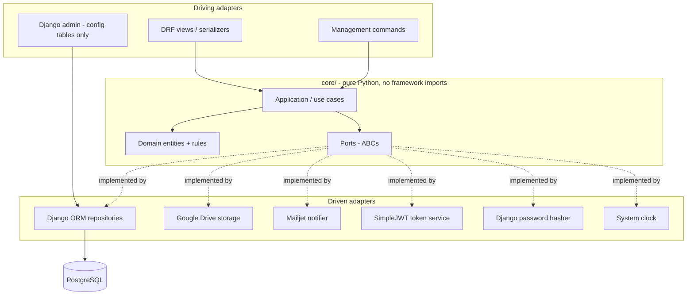

# Backend Low-Level Design — PlasticKothay

**Status:** Draft for review
**Date:** 2026-07-17
**Scope:** Backend only. Frontend LLD is a separate document.

> **This document supersedes parts of `refactoring_plan.md` and `milestones_and_issues.md`.**
> Those documents assume MongoDB + `mongoengine` + a custom JWT auth class. That stack has been
> replaced (see §1.1). Their MongoEngine serializer sections and `MongoJWTAuthentication` design
> are obsolete. See §14 for what to do with them.

---

## 1. Context

### 1.1 What changed from the original plans

| Area | Original plan | Now |
|---|---|---|
| Database | MongoDB via `mongoengine` | PostgreSQL (Supabase-hosted) via Django ORM |
| Auth | Custom `MongoJWTAuthentication` | `djangorestframework-simplejwt` + httpOnly refresh cookie |
| Serializers | Hand-written, to dodge `ModelSerializer` | Hand-written, because hexagonal (serializes domain dataclasses, not ORM models) |
| Templates | Migrate to API | Deleted entirely |
| CORS | Required | Not required (same-origin deployment) |
| Architecture | Layered Django | Hexagonal (ports & adapters) |
| Scope | Posts + auth + admin | Also: engagement (likes), points, leaderboard, contact, feedback |

### 1.2 Feature scope

- User accounts. Self-registration with OTP email verification. Admins can promote users to staff/admin.
- Reports ("posts"). Submittable by **anyone** — authenticated or anonymous. Photo goes to Google Drive.
- Moderation. Admins approve/reject/hide. **Only approved posts are public.**
- Engagement. Authenticated and anonymous users can like a post. **One like per user per post.**
- Points. Authenticated users earn points from approved posts and from likes given/received.
- Leaderboard. All-time / year / month / week. **Computed by query — no score table.**
- Contact page (admin-editable content + inbound messages) and Feedback (rating + comment).

### 1.3 Non-goals for v1

- Comments (modelled, seeded inactive, not exposed).
- Badges/referrals (modelled, not populated).
- Request/telemetry tracking middleware (deferred — no async infrastructure).
- Redis, Celery, nginx.

---

## 2. Architecture

Hexagonal (ports & adapters). One Django project, one deployable. The hexagon is `core/`;
everything else is an adapter around it.



### 2.1 The import rule (non-negotiable)

Nothing under `core/` may import:

`django`, `rest_framework`, `psycopg`, `google.*`, `anymail`, or anything from `adapters/` or `api/`.

**Enforce it mechanically.** Add `import-linter` to CI (or a test that walks the AST of every module
under `core/` and asserts its imports). Without enforcement this boundary erodes within weeks and the
DB port becomes decorative — which is the exact failure this architecture exists to prevent.

**Acceptance test for the architecture:** the entire use-case suite must run green against in-memory
fake repositories with **no database running**. If it can't, the hexagon isn't real.

### 2.2 Why the domain can't be Django models

Django ORM models are Active Record: they carry `.save()`, `.objects`, and DB semantics. If use cases
manipulate them directly, the persistence port is fiction. So:

- `core/domain/entities.py` — plain dataclasses. No `.save()`.
- `adapters/persistence/django_orm/models.py` — the ORM models.
- `adapters/persistence/django_orm/mappers.py` — translate between them.

This is real cost (a mapper layer). It buys the swappability that motivated the architecture.

---

## 3. Project layout

```
backend/
├── manage.py
├── config/
│   ├── settings/           base.py, dev.py, prod.py
│   ├── urls.py
│   └── container.py        composition root — wires ports to adapters
├── core/                   ← THE HEXAGON. No framework imports. Ever.
│   ├── domain/
│   │   ├── entities.py
│   │   ├── value_objects.py
│   │   ├── errors.py
│   │   └── points.py       point calculation rules (pure)
│   ├── ports/
│   │   ├── repositories.py
│   │   ├── storage.py
│   │   ├── notifications.py
│   │   ├── security.py
│   │   ├── unit_of_work.py
│   │   └── clock.py
│   └── application/
│       ├── accounts/       register, verify, login, refresh, logout, reset password
│       ├── reports/        submit, list, get, update, approve, reject, hide
│       ├── engagement/     like, unlike, feedback, contact message
│       ├── content/        get/update contact page
│       └── scoring/        contribution, leaderboard
├── adapters/
│   ├── persistence/django_orm/   models.py, mappers.py, repositories.py, unit_of_work.py
│   ├── storage/gdrive.py         wraps existing fileupload.py
│   ├── notifications/mailjet.py  wraps existing email_control.py
│   ├── security/                 jwt_service.py, password_hasher.py
│   └── system/clock.py
└── api/                    ← Django app. DRF only. Thin.
    ├── authentication.py   cookie-aware JWT auth
    ├── permissions.py      IsAdmin, IsStaffOrAdmin
    ├── pagination.py
    ├── throttling.py
    ├── exception_handler.py
    ├── auth/               views, serializers, urls
    ├── reports/
    ├── engagement/
    ├── content/
    ├── scoring/
    └── admin/
```

The old `plastickothay` and `superadmin` Django apps dissolve: views → `api/`, models →
`adapters/persistence/django_orm/`. `superadmin/forms.py`, `superadmin/auth_backends.py`, and all
templates are deleted.

---

## 4. Domain model

### 4.1 Value objects (`core/domain/value_objects.py`)

```python
class Severity(IntEnum):
    LOW = 1; MINOR = 2; MODERATE = 3; HIGH = 4; CRITICAL = 5

class PostStatus(IntEnum):
    REJECTED = 0    # refused; image deleted from Drive; soft-deleted
    APPROVED = 1    # public; earns points
    PENDING  = 2    # awaiting review; not public; no points
    HIDDEN   = 3    # was approved, taken down; not public; no points; image retained

class EngagementType(StrEnum):
    LIKE = "like"; COMMENT = "comment"

class Role(StrEnum):
    USER = "user"; STAFF = "staff"; ADMIN = "admin"

@dataclass(frozen=True)
class Reporter:                 # contact details for a report
    name: str; email: str; phone: str

@dataclass(frozen=True)
class GeoPoint:
    lat: float; lon: float

@dataclass(frozen=True)
class ImageRef:
    provider: str               # "gdrive"
    external_id: str
```

Replaces the magic numbers currently scattered across the codebase (`status=1`, `user_type=3`).

### 4.2 Entities (`core/domain/entities.py`)

```python
@dataclass
class User:
    id: UserId | None
    username: str
    email: str
    first_name: str
    last_name: str
    phone: str
    role: Role
    is_verified: bool           # completed OTP
    is_active: bool             # not banned
    date_joined: datetime
    last_login: datetime | None

@dataclass
class Post:
    id: PostId | None
    reporter: Reporter          # ALWAYS present
    reporter_id: UserId | None  # None ⇒ anonymous submission
    severity: Severity
    image: ImageRef
    location: GeoPoint
    description: str
    status: PostStatus
    created: datetime
    approved_at: datetime | None   # set on first approval; drives leaderboard periods
    deleted_at: datetime | None    # soft delete

    @property
    def is_public(self) -> bool:
        return self.status is PostStatus.APPROVED and self.deleted_at is None

@dataclass
class Engagement:
    id: EngagementId | None
    post_id: PostId
    type: EngagementType
    actor_id: UserId | None     # None ⇒ anonymous
    body: str | None            # comments only
    created: datetime

    @property
    def earns_points(self) -> bool:
        return self.actor_id is not None    # anonymous engagement earns nobody anything

@dataclass
class PointRule:
    code: str                   # "post_approved", "like_received", "like_given"
    points: int
    active: bool
    description: str

@dataclass
class LevelRule:
    level: int
    min_points: int
    title: str

@dataclass
class Feedback:                 # the "rate us" page
    id: FeedbackId | None
    user_id: UserId | None
    name: str; email: str
    rating: int                 # 1..5
    comment: str
    created: datetime
    # never displayed publicly (product decision) — no moderation status needed

@dataclass
class ContactMessage:
    id: ContactMessageId | None
    user_id: UserId | None
    name: str; email: str; phone: str
    subject: str; message: str
    status: str                 # new | read | replied
    created: datetime

@dataclass
class SocialLink:
    platform: str; url: str; order: int

@dataclass
class ContactPage:              # singleton, admin-editable
    heading: str
    intro: str
    email: str; phone: str; address: str
    map_point: GeoPoint | None
    socials: list[SocialLink]
    updated_at: datetime
    updated_by: UserId | None

@dataclass
class PostModerationLog:        # audit trail for humans. NEVER an input to point calculation.
    id: int | None
    post_id: PostId
    admin_id: UserId
    action: str                 # approve | reject | hide | unhide
    reason: str
    at: datetime
```

### 4.3 Domain errors (`core/domain/errors.py`)

`DomainError` base, then: `PostNotFound`, `PostNotPublic`, `UserNotFound`, `UsernameTaken`,
`EmailTaken`, `InvalidCredentials`, `AccountNotVerified`, `AccountDisabled`, `OTPInvalid`,
`OTPExpired`, `AlreadyLiked`, `NotLiked`, `SelfLikeNotAllowed`, `NotAuthorized`, `ImageUploadFailed`.

Each maps to one HTTP status in exactly one place (§8.5). No view ever writes a status code for a
domain failure.

---

## 5. Points & leaderboard

### 5.1 Model: derived from current state. No ledger, no score table.

Points are **computed**, never stored. A user's score is a pure function of:
current post statuses × current engagement rows × currently-active point rules.

Consequences, accepted deliberately:

- **Reversal is free.** Hide or reject a post and its points stop counting automatically — the
  query filters on `status = APPROVED`. Likes on that post stop counting in the same instant. There
  is no cascade to write, no compensating entry, no double-deduct guard, no drift.
- **Un-hiding restores points automatically.** No re-award path.
- **Rule changes rewrite history retroactively.** Changing `post_approved` from 100 → 150 changes
  everyone's past scores immediately — there is no gradual rollout and no per-user migration. This is
  accepted, and mitigated **operationally, not technically**: rule changes are announced to all users
  ahead of the release (DEC-2, §13).
- **No audit trail.** "Why do I have 4,237 points?" can only be answered by re-running the query.

### 5.2 Rules (seeded data, `PointRule` table)

| code | points | active | meaning |
|---|---|---|---|
| `post_approved` | 100 | ✅ | your post was approved |
| `like_received` | 3 | ✅ | an authenticated user liked your approved post |
| `like_given` | 1 | ✅ | you liked someone else's approved post |
| `comment_received` | 5 | ❌ | v2 |
| `comment_given` | 2 | ❌ | v2 |

Deactivating a rule (`active = False`) stops it counting **immediately and retroactively** — this is
the "we can cancel engagement points" capability, and it needs no migration.

### 5.3 Counting rules (`core/domain/points.py` — pure, unit-testable)

An engagement counts toward points only if **all** hold:

1. `engagement.actor_id is not None` — anonymous likes are recorded and displayed, but award nothing
   to anyone, including the post owner. **This is a security control, not a product choice** — see
   DEC-1 in §13.
2. `post.status == APPROVED and post.deleted_at is None`.
3. `engagement.actor_id != post.reporter_id` — **self-likes award zero to both sides**.
4. The relevant `PointRule.active` is true.

A post counts toward its owner only if it is approved, not deleted, and `reporter_id is not None`
(anonymous reports earn nobody points).

### 5.4 Leaderboard: query only

Periods: `all` | `year` | `month` | `week`. Bucketed by:

- posts → `approved_at` (DEC-3)
- likes → `engagement.created`

A post filed Saturday and approved Tuesday therefore scores in Tuesday's week. Accepted: moderation
is actively staffed, so approval lag stays short.

All datetimes stored UTC; **period boundaries computed in `Asia/Dhaka` (UTC+6)**. The current code
mixes `datetime.utcnow()` and `datetime.now()` — do not carry that forward. One canonical timezone,
set in settings, used by `Clock`.

Shape of the query (three CTEs, one aggregate):

```sql
WITH bounds AS (SELECT %(start)s::timestamptz AS t0),
post_pts AS (
    SELECT p.reporter_user_id AS user_id, COUNT(*) * %(post_approved)s AS pts
    FROM   post p, bounds b
    WHERE  p.status = 1 AND p.deleted_at IS NULL
      AND  p.reporter_user_id IS NOT NULL
      AND  p.approved_at >= b.t0
    GROUP  BY 1
),
recv_pts AS (
    SELECT p.reporter_user_id AS user_id, COUNT(*) * %(like_received)s AS pts
    FROM   engagement e JOIN post p ON p.id = e.post_id, bounds b
    WHERE  e.type = 'like' AND e.actor_user_id IS NOT NULL
      AND  e.actor_user_id <> p.reporter_user_id
      AND  p.status = 1 AND p.deleted_at IS NULL
      AND  p.reporter_user_id IS NOT NULL
      AND  e.created >= b.t0
    GROUP  BY 1
),
given_pts AS (
    SELECT e.actor_user_id AS user_id, COUNT(*) * %(like_given)s AS pts
    FROM   engagement e JOIN post p ON p.id = e.post_id, bounds b
    WHERE  e.type = 'like' AND e.actor_user_id IS NOT NULL
      AND  e.actor_user_id <> p.reporter_user_id
      AND  p.status = 1 AND p.deleted_at IS NULL
      AND  e.created >= b.t0
    GROUP  BY 1
)
SELECT u.id, u.username, COALESCE(SUM(x.pts), 0) AS total
FROM   auth_user u
LEFT   JOIN (SELECT * FROM post_pts UNION ALL
             SELECT * FROM recv_pts UNION ALL
             SELECT * FROM given_pts) x ON x.user_id = u.id
GROUP  BY u.id, u.username
HAVING COALESCE(SUM(x.pts), 0) > 0
ORDER  BY total DESC, u.date_joined ASC
LIMIT  %(limit)s OFFSET %(offset)s;
```

Inactive rules are handled by passing `0` for their point value from `PointRule`.
Ties break on earliest `date_joined`.

This lives in the **repository adapter** (it's SQL), behind a `LeaderboardRepository` port. The
*rules* (§5.3) live in the domain and are unit-tested without a DB.

**Scaling escape hatch:** when this gets slow, add a `MATERIALIZED VIEW` + periodic `REFRESH` and
point an unmanaged model at it. No application change, still "no score model". Do not pre-optimize.

### 5.5 Contribution (per-user)

Replaces today's `contribution()` view, which hardcodes `reviews_written = 0`, `friends_referred = 0`
and "every 5 points = 1 level". Levels come from the `LevelRule` table instead of being hardcoded.
Referrals stay 0 until a referral system exists.

---

## 6. Ports (`core/ports/`)

All ABCs. All accept and return **domain types** — never ORM models, never `QuerySet`.

```python
# repositories.py
class UserRepository(ABC):
    def get(self, id: UserId) -> User | None: ...
    def get_by_username(self, username: str) -> User | None: ...
    def get_by_email(self, email: str) -> User | None: ...
    def add(self, user: User, password: str) -> User: ...
    def update(self, user: User) -> User: ...
    def set_password(self, id: UserId, password: str) -> None: ...
    def verify_password(self, id: UserId, password: str) -> bool: ...

class PostRepository(ABC):
    def get(self, id: PostId) -> Post | None: ...
    def add(self, post: Post) -> Post: ...
    def update(self, post: Post) -> Post: ...
    def list(self, f: PostFilter, page: PageRequest) -> Page[Post]: ...
    def list_map_markers(self) -> list[MapMarker]: ...   # approved only, thin
    def counts_by_status(self) -> dict[PostStatus, int]: ...

class EngagementRepository(ABC):
    def add(self, e: Engagement) -> Engagement: ...
    def remove_like(self, post_id: PostId, actor_id: UserId) -> bool: ...
    def get_like(self, post_id: PostId, actor_id: UserId) -> Engagement | None: ...
    def count_likes(self, post_id: PostId) -> int: ...

class LeaderboardRepository(ABC):
    def top(self, period: Period, rules: dict[str, int], page: PageRequest) -> Page[LeaderboardRow]: ...
    def contribution_for(self, user_id: UserId, rules: dict[str, int]) -> Contribution: ...

class PointRuleRepository(ABC):
    def active_rules(self) -> dict[str, int]: ...   # code -> points (0 if inactive)

class LevelRuleRepository(ABC):
    def level_for(self, points: int) -> LevelRule: ...
    def next_level(self, points: int) -> LevelRule | None: ...

class OTPRepository(ABC):
    def add(self, otp: OTP) -> OTP: ...
    def latest_valid_for(self, username: str, now: datetime) -> OTP | None: ...
    def invalidate_for(self, username: str) -> None: ...
    def purge_expired(self, now: datetime) -> int: ...

class FeedbackRepository(ABC): ...
class ContactRepository(ABC):
    def get_page(self) -> ContactPage: ...
    def save_page(self, page: ContactPage) -> ContactPage: ...
    def add_message(self, m: ContactMessage) -> ContactMessage: ...
    def list_messages(self, page: PageRequest) -> Page[ContactMessage]: ...

class ModerationLogRepository(ABC):
    def add(self, entry: PostModerationLog) -> None: ...

# storage.py
class ImageStorage(ABC):
    def upload(self, data: bytes, filename: str, content_type: str) -> ImageRef: ...
    def delete(self, ref: ImageRef) -> None: ...
    def public_url(self, ref: ImageRef) -> str: ...

# notifications.py
class Notifier(ABC):
    def send_otp(self, to: str, code: int, purpose: str) -> None: ...
    def send_post_approved(self, to: str, post: Post) -> None: ...
    def send_post_rejected(self, to: str, post: Post, reason: str) -> None: ...

# security.py
class TokenService(ABC):
    def issue(self, user: User) -> TokenPair: ...
    def verify_access(self, token: str) -> TokenClaims: ...
    def verify_refresh(self, token: str) -> TokenClaims: ...
    def rotate(self, refresh_token: str) -> TokenPair: ...
    def revoke(self, refresh_token: str) -> None: ...

class PasswordHasher(ABC):
    def hash(self, raw: str) -> str: ...
    def verify(self, raw: str, hashed: str) -> bool: ...

# unit_of_work.py
class UnitOfWork(ABC):
    def __enter__(self) -> "UnitOfWork": ...
    def __exit__(self, *exc) -> None: ...
    def commit(self) -> None: ...
    def rollback(self) -> None: ...

# clock.py
class Clock(ABC):
    def now(self) -> datetime: ...      # tz-aware UTC
    def today_local(self) -> date: ...  # in Asia/Dhaka
```

**Why `UnitOfWork`:** `transaction.atomic()` is a Django import and cannot appear in `core/`. Use
cases that must be all-or-nothing (submit report = upload image + insert row) declare the boundary;
the Django adapter implements it with `atomic()`. Retrofitting transaction boundaries later is
miserable — design them in now.

**Why `Clock`:** OTP expiry and leaderboard period boundaries are time-dependent. A port makes them
testable without `sleep()`.

---

## 7. Application layer (`core/application/`)

Each use case is a class: ports injected via `__init__`, one `execute()`. Commands/results are
dataclasses (not DRF serializers — the domain must not know DRF exists).

| Module | Use cases |
|---|---|
| `accounts` | `RegisterUser`, `VerifyOTP`, `ResendOTP`, `Login`, `RefreshToken`, `Logout`, `RequestPasswordReset`, `ResetPassword`, `GetProfile`, `UpdateProfile` |
| `accounts` (admin) | `ListUsers`, `SetUserRole`, `SetUserActive` |
| `reports` | `SubmitReport`, `ListReports`, `GetReport`, `ListMapMarkers`, `UpdateReportDescription` |
| `reports` (admin) | `ApproveReport`, `RejectReport`, `HideReport`, `UnhideReport`, `ListReportsForReview` |
| `engagement` | `LikePost`, `UnlikePost`, `SubmitFeedback`, `SubmitContactMessage` |
| `content` | `GetContactPage`, `UpdateContactPage` |
| `scoring` | `GetContribution`, `GetLeaderboard` |

### 7.1 `SubmitReport` — the anonymous/authenticated split

```python
class SubmitReport:
    def __init__(self, posts, users, images, uow, clock): ...

    def execute(self, cmd: SubmitReportCommand, actor_id: UserId | None) -> Post:
        reporter = self._resolve_reporter(cmd, actor_id)
        with self.uow:
            image = self.images.upload(cmd.photo_bytes, cmd.filename, cmd.content_type)
            post = Post(
                id=None, reporter=reporter, reporter_id=actor_id,
                severity=Severity(cmd.severity), image=image,
                location=GeoPoint(cmd.lat, cmd.lon),
                description=cmd.description or "No description provided.",
                status=PostStatus.PENDING,
                created=self.clock.now(), approved_at=None, deleted_at=None,
            )
            saved = self.posts.add(post)
            self.uow.commit()
        return saved

    def _resolve_reporter(self, cmd, actor_id) -> Reporter:
        if actor_id is None:
            return Reporter(cmd.name, cmd.email, cmd.phone)   # anonymous: trust the body
        u = self.users.get(actor_id)                          # authenticated: trust the token
        return Reporter(f"{u.first_name} {u.last_name}".strip(), u.email, u.phone)
```

**Security note:** for authenticated submissions the reporter block comes from the **stored profile**,
and client-supplied name/email/phone are ignored. Otherwise a logged-in user can attach a stranger's
email and phone to a report.

The use case receives **decoded bytes**, not a base64 string — base64 is transport encoding and is
decoded at the serializer. Today's view does the `;base64,` split inline
(`plastickothay/views.py:47`); that logic moves to the edge.

### 7.2 `LikePost`

```python
def execute(self, post_id: PostId, actor_id: UserId | None) -> LikeResult:
    post = self.posts.get(post_id)
    if post is None or not post.is_public:
        raise PostNotFound()                       # non-public posts are not likeable
    if actor_id is not None and actor_id == post.reporter_id:
        raise SelfLikeNotAllowed()
    with self.uow:
        e = Engagement(None, post_id, EngagementType.LIKE, actor_id, None, self.clock.now())
        self.engagements.add(e)                    # UNIQUE constraint is the real guard
        self.uow.commit()
    return LikeResult(likes=self.engagements.count_likes(post_id))
```

Uniqueness is enforced by the DB constraint (§9.3), not by a read-then-write check — a check-then-act
race under concurrent requests would otherwise let a double-like through. Catch `IntegrityError` in the
**repository adapter** and re-raise as the domain's `AlreadyLiked`.

⚠️ **Anonymous likes have no stable identity**, so the unique constraint cannot bind them (§13, DEC-1).

### 7.3 `ApproveReport` / `RejectReport` / `HideReport`

```python
# ApproveReport
post.status = PostStatus.APPROVED
post.approved_at = post.approved_at or clock.now()   # first approval only — stable period bucket
moderation_log.add(...)
notifier.send_post_approved(post.reporter.email, post)

# RejectReport
images.delete(post.image)          # Drive file removed
post.status = PostStatus.REJECTED
post.deleted_at = clock.now()      # SOFT delete — today's code hard-deletes the row
moderation_log.add(...)

# HideReport
post.status = PostStatus.HIDDEN    # image retained, post non-public, points stop counting
```

**No points logic appears in any of these.** That is the entire benefit of the derived model
(§5.1): status is the only thing that moves, and the score query reads status.

---

## 8. API layer (`api/`)

DRF views are thin: validate → call use case → serialize. No business logic, no ORM access.

### 8.1 Authentication

`djangorestframework-simplejwt`, with cookie transport for the refresh token.

| | Access token | Refresh token |
|---|---|---|
| Lifetime | 15 min | 7 days |
| Transport | `Authorization: Bearer` header | httpOnly cookie |
| Storage (browser) | **memory only** — never localStorage | `HttpOnly; Secure; SameSite=Lax; Path=/api/auth/` |
| Revocable | no | yes (SimpleJWT blacklist app) |

- On page reload the access token is gone; the SPA calls `POST /api/auth/refresh/` on boot. Normal.
- `Logout` blacklists the refresh token **and** clears the cookie. Real logout.
- Rotation on refresh, with blacklist-after-rotation.
- **Same-origin deployment is required for this** (§11.2).

`api/authentication.py` subclasses `JWTAuthentication` and **returns `None` (not 401) when no token is
present**, so anonymous requests reach `AllowAny` endpoints with `request.user` anonymous.

### 8.2 Permissions

Default is `IsAuthenticated`. Public endpoints override with `AllowAny` **explicitly**.

> ⚠️ Every public endpoint needs an explicit override. Forget one and the map breaks. The list of
> `AllowAny` endpoints in §10 is the checklist.

`IsAdmin` = `is_superuser`. `IsStaffOrAdmin` = `is_staff or is_superuser`.

### 8.3 Serializers — the public/admin split

> **This closes a live PII leak.** Today `posts()` (`plastickothay/views.py:82`) defaults to
> `Post.objects()` — every post regardless of status — and the `PostSerializer` in
> `refactoring_plan.md` exposes `email` and `pN`. Ported as-is, `/api/posts/` would publicly serve the
> name, email, and phone of every person who ever filed a report, approved or not.

| Serializer | Fields | Used by |
|---|---|---|
| `PublicPostSerializer` | id, severity, image_url, lat, lon, description, created, likes, liked_by_me. **`reporter.name` only** | public list/detail |
| `MapMarkerSerializer` | id, lat, lon, severity | map |
| `AdminPostSerializer` | everything incl. reporter email/phone, status, moderation history | admin only |
| `OwnPostSerializer` | public fields + own status | `/api/me/posts/` |

Reporter email and phone are **never** reachable without an admin token.

Serializers translate between JSON and use-case commands/results. They never touch ORM models.

### 8.4 Filtering & pagination

> Today's `filter` param is a single overloaded value (`today` / `last_week` / `severity_3` /
> `accepted` / `pending`) meaning three orthogonal things at once — so "accepted **and** severity 3"
> is inexpressible. Replaced with real params:

```
GET /api/posts/?severity=3&created_after=2026-07-01&created_before=2026-07-17&cursor=...&limit=20
GET /api/admin/posts/?status=pending&severity=3&...      (admin only: status filter)
```

- **Public list endpoints filter to APPROVED in the use case**, not the view. Status is not a public
  query parameter.
- Cursor pagination on `(created DESC, id DESC)`. Default 20, max 100.
- **Map is a separate endpoint** returning thin markers. Today's `home()` does
  `Post.objects(status=1).to_json()` — every accepted post, unbounded, into the page. The map wants
  thousands of thin markers; the feed wants twenty fat records. They are not the same query.

### 8.5 Error envelope

One custom `EXCEPTION_HANDLER` maps `DomainError` → HTTP. Every error response:

```json
{ "error": { "code": "OTP_EXPIRED", "message": "This code has expired.", "details": {} } }
```

| Domain error | HTTP |
|---|---|
| `PostNotFound`, `UserNotFound` | 404 |
| `AlreadyLiked`, `UsernameTaken`, `EmailTaken`, `SelfLikeNotAllowed` | 409 |
| `OTPInvalid`, `OTPExpired`, `InvalidCredentials` | 400 |
| `AccountNotVerified`, `AccountDisabled` | 403 |
| `NotAuthorized` | 403 |
| `ImageUploadFailed` | 502 |
| validation | 400 |

### 8.6 Throttling

DRF throttling. **Cache backend must be `DatabaseCache`**, not the default `LocMemCache`.

> `LocMemCache` is per-process: with 4 Gunicorn workers a "10/hour" limit becomes ~40/hour and drifts
> depending on which worker serves the request. `DatabaseCache` (via `createcachetable`) is shared and
> correct. Slower than Redis; fine at this scale. Revisit if Redis ever exists.

| Scope | Limit | Why |
|---|---|---|
| `anon_post_submit` | 5/hour/IP | anonymous reporting is open |
| `anon_like` | 30/hour/IP | anonymous likes are unbounded by identity (DEC-1) |
| `auth_like` | 200/day/user | collusion ceiling |
| `contact_submit` / `feedback_submit` | 5/hour/IP | spam |
| `login` | 10/hour/IP | credential stuffing |
| `otp_resend` | 3/hour/user | email cost |

**Throttles are not invariants.** "One like per user per post" is a `UNIQUE` constraint (§9.3), not a
rate limit. A throttle is probabilistic and time-windowed; a constraint is absolute and holds even
when application logic is wrong or two requests race. Never enforce an invariant with a throttle.

---

## 9. Persistence (`adapters/persistence/django_orm/`)

### 9.1 Custom user model — decide before the first migration

```python
class User(AbstractUser):
    phone = models.CharField(max_length=20, blank=True)
    is_verified = models.BooleanField(default=False)   # completed OTP
    email = models.EmailField(unique=True)
    # from AbstractUser: username, first_name, last_name, password,
    #                    is_staff, is_superuser, is_active, last_login, date_joined
```

> ⚠️ **`AUTH_USER_MODEL = "persistence.User"` must be set before the first migration is run.**
> Changing it afterwards is one of the genuinely painful operations in Django. This is the single
> most irreversible decision in the backend.

Role mapping (replaces `user_type` 1/2/3):

| Old | New |
|---|---|
| `user_type = 1` (superadmin) | `is_superuser = True` |
| `user_type = 2` (admin) | `is_staff = True` |
| `user_type = 3` (user) | neither |

**`is_active` vs `is_verified`:** today's Mongo model defaults `is_active = False` and uses it to gate
unverified accounts, conflating two ideas. Separate them: `is_verified` = completed OTP;
`is_active` = not banned (Django's meaning, defaults `True`).

### 9.2 Tables

`user`, `otp`, `post`, `engagement`, `point_rule`, `level_rule`, `badge_rule`, `user_badge`,
`feedback`, `contact_page` (singleton), `contact_message`, `post_moderation_log`.

`Rate` (currently a fieldless document, `plastickothay/models.py`) is replaced by `feedback`.

### 9.3 Constraints & indexes

```python
class Engagement(models.Model):
    class Meta:
        constraints = [
            # ONE LIKE PER USER PER POST — partial, so comments (later) stay unconstrained
            models.UniqueConstraint(
                fields=["post", "actor_user"],
                condition=Q(type="like") & Q(actor_user__isnull=False),
                name="uniq_like_per_user_per_post",
            ),
        ]
        indexes = [
            models.Index(fields=["post", "type"]),
            models.Index(fields=["actor_user", "type"]),
            models.Index(fields=["created"]),
        ]
```

The condition is essential: a blanket unique on `(post, actor_user)` would also forbid a user leaving
two comments on a post once comments ship.

```python
class Post(models.Model):
    class Meta:
        indexes = [
            models.Index(fields=["status", "-created"]),        # public feed
            models.Index(fields=["status", "approved_at"]),     # leaderboard periods
            models.Index(fields=["reporter_user", "status"]),   # contribution
        ]
        constraints = [
            models.CheckConstraint(check=Q(severity__gte=1) & Q(severity__lte=5), name="severity_range"),
            models.CheckConstraint(check=Q(lat__gte=-90) & Q(lat__lte=90), name="lat_range"),
            models.CheckConstraint(check=Q(lon__gte=-180) & Q(lon__lte=180), name="lon_range"),
        ]
```

`ContactPage` singleton: `CheckConstraint(check=Q(id=1))`.

### 9.4 OTP without a TTL index

The Mongo model used a TTL index to self-expire OTPs. Postgres has no TTL. Therefore:

- Always filter `expires_at > now()` on read — **correctness never depends on cleanup running.**
- Opportunistic purge: `RegisterUser`/`ResendOTP` deletes that username's expired rows.
- Optional periodic `manage.py purge_expired_otps` if a scheduler ever exists.

### 9.5 Mappers

`mappers.py` holds `to_domain(orm) -> Entity` and `to_orm(entity) -> orm` per aggregate. Repositories
are the **only** place ORM objects are touched. Nothing above them ever sees a `QuerySet`.

---

## 10. API contract

`A` = anonymous allowed. `U` = authenticated. `S` = staff/admin. `SU` = superuser.

### Auth
| Method | Path | Who | Notes |
|---|---|---|---|
| POST | `/api/auth/register/` | A | creates unverified user, emails OTP |
| POST | `/api/auth/verify/` | A | `{username, code}` → verified |
| POST | `/api/auth/resend-otp/` | A | throttled |
| POST | `/api/auth/login/` | A | → access in body, refresh in httpOnly cookie |
| POST | `/api/auth/refresh/` | A | reads cookie → new access (+ rotated cookie) |
| POST | `/api/auth/logout/` | U | blacklists refresh, clears cookie |
| POST | `/api/auth/forgot-password/` | A | emails OTP |
| POST | `/api/auth/reset-password/` | A | `{username, code, new_password}` |

### Me
| Method | Path | Who |
|---|---|---|
| GET / PATCH | `/api/me/` | U |
| GET | `/api/me/posts/` | U |
| GET | `/api/me/contribution/` | U |

### Posts
| Method | Path | Who | Notes |
|---|---|---|---|
| GET | `/api/posts/` | **A** | approved only, cursor-paginated, `PublicPostSerializer` |
| POST | `/api/posts/` | **A** | anonymous or authenticated; throttled |
| GET | `/api/posts/<id>/` | **A** | approved only |
| PATCH | `/api/posts/<id>/` | U | owner only, description only |
| GET | `/api/map/posts/` | **A** | thin markers, approved only |
| POST | `/api/posts/<id>/like/` | **A** | anonymous allowed, awards nothing (DEC-1) |
| DELETE | `/api/posts/<id>/like/` | U | |

### Engagement / content
| Method | Path | Who |
|---|---|---|
| GET | `/api/contact-page/` | **A** |
| POST | `/api/contact-messages/` | **A** |
| POST | `/api/feedback/` | **A** |

### Scoring
| Method | Path | Who | Notes |
|---|---|---|---|
| GET | `/api/leaderboard/?period=all\|year\|month\|week` | **A** | paginated |

### Admin
| Method | Path | Who |
|---|---|---|
| GET | `/api/admin/posts/?status=pending&...` | S |
| POST | `/api/admin/posts/<id>/approve/` | S |
| POST | `/api/admin/posts/<id>/reject/` | S |
| POST | `/api/admin/posts/<id>/hide/` | S |
| POST | `/api/admin/posts/<id>/unhide/` | S |
| GET | `/api/admin/stats/` | S |
| GET | `/api/admin/users/` | S |
| PATCH | `/api/admin/users/<id>/role/` | **SU** |
| PATCH | `/api/admin/users/<id>/active/` | S |
| GET/PUT | `/api/admin/contact-page/` | S |
| GET | `/api/admin/contact-messages/` | S |
| PATCH | `/api/admin/contact-messages/<id>/` | S |
| GET | `/api/admin/feedback/` | S |
| GET/PUT | `/api/admin/point-rules/` | **SU** |

The **12 `AllowAny` endpoints above are the complete public surface.** Anything not on this list
requires a token.

---

## 11. Configuration & deployment

### 11.1 Dependencies

**Add:** `djangorestframework`, `djangorestframework-simplejwt`, `psycopg[binary]`,
`django-cors-headers` (dev only), `import-linter` (CI).

**Remove:** `mongoengine`, `pymongo`, `dnspython`, `django-mongo-sessions`.

**Keep:** `django-anymail` (Mailjet), `google-api-python-client` + auth stack (Drive), `whitenoise`,
`gunicorn`, `pillow`, `python-dotenv`.

### 11.2 Same-origin deployment (required)

```
Production:   Django + Whitenoise serves frontend/dist  →  SPA and API share an origin
Development:  Vite dev server proxies /api → localhost:8000  →  same origin
```

> This is **load-bearing, not a preference.** The httpOnly refresh cookie only works cleanly
> first-party. Deploy the SPA on a separate origin and you need `SameSite=None; Secure`, CORS with
> credentials, and CSRF protection on the refresh endpoint. Serving `dist/` from Django avoids all of
> it — and with no nginx available, it is also the only way to get same-origin.
>
> **Consequence: CORS is not needed in production.** Milestone 1 of `milestones_and_issues.md` exists
> largely to configure CORS. Keep `django-cors-headers` for dev flexibility only.

Django URL order: `/api/*` → DRF; `/django-admin/*` → Django admin; everything else → SPA index
(catch-all, so client-side routing works on hard refresh).

### 11.3 Settings

Sessions and `django.contrib.sessions` middleware are dropped (JWT is stateless) — **except** that
Django admin needs sessions. Keep sessions mounted for `/django-admin/` only, or accept the middleware
and use JWT for the API regardless. Recommend the latter: simpler, cost is one cookie for staff.

`TIME_ZONE = "Asia/Dhaka"`, `USE_TZ = True`. Store UTC, bucket periods in Dhaka time.

### 11.4 Django admin — narrow use, deliberately

Now that the ORM is in play, Django admin works for free. Use it — but **only for config tables**:
`point_rule`, `level_rule`, `badge_rule`, `contact_page`.

**Never register `Post` in Django admin.** Approving a post has real behaviour (email, points,
Drive deletion, moderation log) that lives in use cases; the admin would bypass all of it and write
`status` directly. That is a data-integrity bug waiting to happen, and it is exactly the kind of
back door hexagonal exists to prevent.

Rule for reviewers: **Django admin may touch tables with no behaviour. Everything else goes through
the API.** React admin replaces even this later; `react-admin` or `Refine` over the DRF endpoints
gives Django-admin-grade CRUD for roughly a day of work.

### 11.5 Synchronous I/O — accepted tradeoff

No Celery means Google Drive uploads and Mailjet sends happen **inside the request**:

- `POST /api/posts/` blocks on the Drive upload. Submission latency = Drive latency.
- `POST /api/auth/register/` blocks on Mailjet. A Mailjet outage hangs registration.

This matches current behaviour, so it is not a regression — but it **requires explicit timeouts**
(Drive 30s, Mailjet 10s) and clean error mapping (`ImageUploadFailed` → 502). Without timeouts a
hung upstream ties up a Gunicorn worker until it dies. Revisit if async infrastructure appears.

---

## 12. Testing

| Layer | How |
|---|---|
| Domain (`core/domain/points.py`, entities) | pure unit tests, no DB, no Django |
| Use cases | in-memory fake repositories; **must pass with Postgres not running** |
| Repositories/mappers | integration tests against real Postgres |
| Leaderboard SQL | integration, with fixture data covering every §5.3 exclusion |
| API | DRF `APIClient`, contract + permission tests |
| Architecture | `import-linter` — `core/` imports nothing framework-shaped |

**Permission tests are mandatory per endpoint**: anonymous / authenticated / staff / superuser. The
global `IsAuthenticated` default plus 12 explicit `AllowAny` overrides is exactly the shape where one
forgotten decorator silently breaks the public map or leaks reporter PII.

Leaderboard tests must cover: anonymous like awards nothing; self-like awards nothing; likes on a
pending post award nothing; hiding an approved post removes its points **and** its likes' points;
un-hiding restores them; an inactive rule contributes zero.

---

## 13. Decision log

| # | Decision | Rationale | Cost |
|---|---|---|---|
| DEC-1 | **Anonymous likes are recorded and displayed but award zero points to anyone**, including the post owner | An anonymous liker has no stable identity, so no unique constraint can bind them. If anonymous likes awarded the owner 3 points, a five-line script would print unlimited points with no account and no OTP — the leaderboard is meaningless in a week. Only authenticated likes move the score. | Like counts include anonymous likes but points don't — needs explaining in the UI |
| DEC-2 | **Points derived from current state; no ledger, no score table.** ✅ Confirmed 2026-07-17 | Reversal, cascade, and drift bugs cannot exist. Hide/reject/un-hide are automatic. Postgres aggregation is fast enough. | Rule changes rewrite history retroactively; no audit trail. **Mitigated operationally: see POL-1.** |
| DEC-3 | Leaderboard periods bucket posts by **`approved_at`**, likes by `engagement.created`. ✅ Confirmed 2026-07-17 | Points become real on approval, so that's the honest date. | Approval lag shifts a post into a later week — accepted, moderation is actively staffed. |
| DEC-4 | Post status is the **only** source of truth for points; `post_moderation_log` is audit-only | Two sources of truth would eventually disagree and silently corrupt scores. | Log can't be used for point queries |
| DEC-5 | Custom `AbstractUser`; `user_type` → `is_staff`/`is_superuser` | Free password hashing, permissions, groups, Django admin. | Irreversible after first migration |
| DEC-6 | Rejected posts are **soft-deleted**; today's code hard-deletes | Preserves audit trail; stops resubmission gaming. | Rows accumulate |
| DEC-7 | Same-origin deployment via Whitenoise | httpOnly cookie needs first-party; no nginx available. | Django serves static assets |
| DEC-8 | `DatabaseCache` for throttling | `LocMemCache` is per-process and multiplies limits by worker count. | Slower than Redis |
| DEC-9 | Django admin for config tables only | Free CRUD without bypassing domain logic. | Reviewers must enforce it |
| DEC-10 | Domain = dataclasses, ORM = adapter | Otherwise the DB port is fiction and the architecture is decorative. | A mapper layer to maintain |

All decisions confirmed as of 2026-07-17. None open.

### 13.1 Operational policies

These are commitments the design **depends on**. They are not enforced by code, so they belong in the
release checklist, not just here.

| # | Policy |
|---|---|
| **POL-1** | **Point rule changes must be announced to all users before release.** DEC-2 makes rule changes retroactive and instantaneous — the moment `point_rule.points` changes, every historical score and the whole leaderboard shift. There is no staged rollout to hide behind. Treat any edit to `point_rule` as a **user-facing release**, not a config tweak: announce first, then flip. ⚠️ **An announcement channel (email blast / in-app banner) does not exist yet and is not in the v1 scope above.** Until it does, POL-1 is a manual promise with nothing behind it. |
| **POL-2** | Moderation queue must be actively staffed. DEC-3 buckets leaderboard periods by approval date, so approval lag directly distorts weekly standings. If the queue ever backs up past ~a day, revisit DEC-3. |

---

## 14. Build order & revised milestones

Backend first. The original 6 milestones had no room for engagement, points, leaderboard, contact, or
feedback; these 8 do.

| # | Milestone | Exit criteria |
|---|---|---|
| **B0** | Skeleton & hexagon | `core/` + ports + fakes + `import-linter` green. **Use-case tests pass with no DB running.** |
| **B1** | Persistence & identity | Custom user model, `AUTH_USER_MODEL` set, migrations, repositories + mappers, integration tests green |
| **B2** | Auth vertical slice | register → OTP → verify → login → refresh → logout, end-to-end, httpOnly cookie working |
| **B3** | Reports | submit (anon + auth), public list, map, detail, cursor pagination, **public/admin serializer split** |
| **B4** | Moderation | approve / reject / hide / unhide, Drive deletion, Mailjet notify, moderation log, admin stats |
| **B5** | Engagement & scoring | like/unlike + partial unique constraint, point rules seeded, contribution, leaderboard (4 periods), §12 leaderboard tests green |
| **B6** | Content | contact page CRUD, contact messages, feedback, Django admin for config tables |
| **B7** | Hardening & cutover | throttles + `DatabaseCache`, timeouts on Drive/Mailjet, permission test matrix, **delete templates + `superadmin`/`plastickothay` apps**, Whitenoise serving `dist/` |

Then the frontend milestones (F0–F5) from `milestones_and_issues.md`, which remain broadly valid.

### 14.1 What to do with the existing documents

- **`refactoring_plan.md`** — §2.2 (MongoEngine serializers), §2.4 (`MongoJWTAuthentication`), and §2.5
  (CORS) are obsolete. Its Gantt chart starts 2026-07-15 and is stale. Rewrite or mark superseded.
- **`milestones_and_issues.md`** — Milestone 1 is largely CORS setup that is no longer needed;
  Milestones 2–3 assume Mongo. The frontend milestones survive. Rewrite the backend half against §14.
