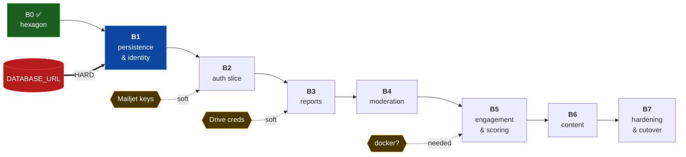

# Backend Milestones B1–B7 — detailed breakdown

**Branch:** `backend`
**Companion to:** `backend_implementation_plan.md` (§4 has the summary table this expands)
**Spec:** `backend_lld.md` · **Reports:** `b0_implementation_report.md`, `b1_implementation_report.md`

> Preview in VS Code (`Cmd+Shift+V`) to render the diagram.

## Progress

| Milestone | Status | Evidence |
|---|---|---|
| **B0** Hexagon skeleton | ✅ complete | 23 commits, 76 unit tests, 4/4 import contracts |
| **B1** Persistence & identity | ✅ complete (SQLite-validated) | +15 integration tests → 91 total; real-Postgres validation pends `DATABASE_URL` |
| **B2** Auth vertical slice | ⏳ next | — |
| **B3** Reports | ⬜ planned | — |
| **B4** Moderation | ⬜ planned | — |
| **B5** Engagement & scoring | ⬜ planned | — |
| **B6** Content | ⬜ planned | — |
| **B7** Hardening & cutover | ⬜ planned | — |

---

## Where the blockers sit

Nothing after B1 is blocked by a credential: Mailjet and Drive sit behind ports, so fake
adapters carry the work and the real ones drop in when keys arrive.

---

# B1 · Persistence & identity ✅

**Goal:** Django enters the project. Domain entities gain a database.
**Blocker (resolved):** built with a SQLite fallback so no credential was needed; real-Postgres
validation against Supabase still pends `DATABASE_URL` + the pooler/direct choice.
**Risk retired:** `AUTH_USER_MODEL` set before the first migration — locked in correctly.
**Full detail:** `b1_implementation_report.md`.

### Tasks

| # | Task | |
|---|---|---|
| 1 | Django + DRF + SimpleJWT + psycopg → `requirements.txt` (+ `requirements-dev.txt`) | ✅ |
| 2 | `manage.py`, `config/settings/{base,dev,prod,test}.py`, `config/urls.py`, `config/wsgi.py` | ✅ |
| 3 | **`AUTH_USER_MODEL` set before any migration** ⚠️ | ✅ |
| 4 | `models.py` — all 12 tables (LLD §9.2) | ✅ |
| 5 | Constraints & indexes: partial unique on likes, severity/lat/lon checks, `ContactPage` singleton | ✅ |
| 6 | `mappers.py` — row ↔ domain, both directions | ✅ |
| 7 | `repositories.py` — every port except `LeaderboardRepository` (B5) | ✅ |
| 8 | `unit_of_work.py` — wraps `transaction.atomic()` | ✅ |
| 9 | `adapters/security/password_hasher.py`, `adapters/system/clock.py` | ✅ |
| 10 | `config/container.py` — composition root | ✅ |
| 11 | `manage.py seed_rules` — point + level rules, idempotent | ✅ |
| 12 | `tests/integration/` — repository tests (SQLite now, Postgres in CI) | ✅ |
| 13 | CI: `pytest` + `lint-imports` + `ruff` | ⬜ **carried to B2** — gates run locally; not yet wired in CI |

### Design notes

**`is_active` vs `is_verified`.** Legacy defaulted `is_active=False` to gate unverified
accounts, conflating "not yet verified" with "banned". Kept separate: `is_verified` gates
sign-in, `is_active` (Django's, defaults `True`) means not banned.

**Role mapping.** `user_type` 1/2/3 → `is_superuser` / `is_staff` / neither, derived in the
mapper (`role_from_flags` / `flags_from_role`). There is no role column — Django's permission
system stays authoritative, and "make staff/admin" is just flipping flags.

**Supabase pooler (6543)** runs pgBouncer in transaction mode → `DISABLE_SERVER_SIDE_CURSORS`
+ `CONN_MAX_AGE=0`, toggled by the `DB_POOLED` env var in `base.py`. Direct (5432) needs
neither. Both are wired; the choice is just which URL you supply.

**`def list()` shadowing** — pre-empted with `from __future__ import annotations` in
`repositories.py`, as flagged in the B0 report.

### Findings (see `b1_implementation_report.md` §3)

**A real transaction bug, caught by an integration test.** An `IntegrityError` raised *inside*
an atomic block marks the whole transaction broken — every later query then raises
`TransactionManagementError`. `LikePost` catches `AlreadyLiked` then reads `count()` in the
same request, so this would turn a duplicate-like (409) into a 500 in production. Fixed by
wrapping each constraint-bearing insert (`User.add`, `Engagement.add`) in its own savepoint.
This is the class of bug the fakes cannot surface — the reason integration tests exist.

### Decisions taken during B1

- **SQLite fallback** when `DATABASE_URL` is unset — unblocks local dev and matches the
  test-SQLite / prod-Postgres strategy. Postgres-only behaviour (concurrency) deferred to B5.
- **Denormalised `post_owner_user` on `Engagement`** — the B5 leaderboard SQL filters likes by
  the post owner; storing it (immutable) avoids a self-join. Captured on insert, tested.
- **`requirements.txt` split** — runtime vs dev tooling, so prod images skip pytest/ruff.
- **Supabase transaction pooler (6543) needs two psycopg3 fixes** — `DISABLE_SERVER_SIDE_CURSORS`
  and `OPTIONS={"prepare_threshold": None}`. Each transaction gets a different backend, so
  server-side cursors and prepared statements break without these. Toggled by `DB_POOLED` in
  `base.py`. (Session pooler on 5432 needs neither, but both are harmless.)
- **Tests never touch the remote database.** `config/settings/test.py` ignores `DATABASE_URL`
  and defaults to in-memory SQLite; set `TEST_DATABASE_URL` to a *local* Postgres for
  full-fidelity runs. Running the suite against the pooler is slow (49s vs 0.3s) and leaves
  dangling `test_*` databases the pooler won't let you drop.

### Exit criteria

- [x] `migrate` applies cleanly — ✅ **Supabase Postgres 17.6** (transaction pooler) and SQLite
- [x] Repository integration tests green against **real Postgres** — **15 passed** on Supabase
- [x] `pytest tests/unit/` still green with no DB — **76 passed**, fakes unaffected
- [x] `lint-imports` still 4/4 — Django did not leak into `core/`
- [x] Partial unique index rejects a duplicate like — verified in real Postgres (`pg_indexes`)
- [x] All 5 check constraints materialised in Postgres (`pg_constraint`)
- [ ] CI runs all three gates — **carried to B2**

**B1 is fully validated.** Connected to Supabase, migrated, seeded, and ran the integration
suite against real Postgres. The transaction pooler needed two psycopg3 fixes (below).

---

# B2 · Auth vertical slice ⏳ next

**Goal:** register → OTP → verify → login → refresh → logout, end to end.
**Blocker:** none hard. Mailjet is soft — Django's console backend stubs it.
**Risk retired:** the httpOnly cookie + same-origin design actually works.
**Inherited from B1:** the `token_blacklist` app is already installed and migrated; the
`REST_FRAMEWORK` auth/exception/pagination hooks were left unset in `base.py` and are wired
here (referencing them before `api/` existed would fail Django's system check). Fold in the
B1-carried CI task (task 13) as part of this milestone.

### Tasks

| # | Task |
|---|---|
| 0 | **CI wiring** (carried from B1): `pytest` + `lint-imports` + `ruff` on every push |
| 1 | `adapters/security/jwt_service.py` — SimpleJWT behind the `TokenService` port |
| 2 | Wire `REST_FRAMEWORK` `DEFAULT_AUTHENTICATION_CLASSES`, `EXCEPTION_HANDLER`, `DEFAULT_PAGINATION_CLASS` (stubbed out in B1's `base.py`) |
| 3 | `api/authentication.py` — **returns `None`, not 401, when no token**, so anonymous reaches `AllowAny` |
| 4 | `api/permissions.py` — `IsAdmin`, `IsStaffOrAdmin` |
| 5 | `api/exception_handler.py` — `DomainError` → HTTP, one place (LLD §8.5) |
| 6 | `api/pagination.py` — cursor over `(created DESC, id DESC)` (the repo already emits these cursors) |
| 7 | `api/auth/` — serializers, views, urls for all 8 endpoints |
| 8 | Refresh cookie: `HttpOnly; Secure; SameSite=Lax; Path=/api/auth/` |
| 9 | `adapters/notifications/mailjet.py` (console backend in dev) |
| 10 | API + permission tests |

### Design notes

**Two email layers, deliberately.** `Notifier` speaks domain intent (`send_otp`);
`EMAIL_BACKEND` is the transport strategy and lives *inside* the Mailjet adapter. If
`Notifier` starts taking subjects and HTML bodies, it has stopped earning its place.

**No Celery** → Mailjet sends inside the request. Needs a 10s timeout, or a hung upstream
ties up a Gunicorn worker until it dies.

### Exit criteria

- [ ] Full flow works end to end
- [ ] Refresh cookie is set on login, rotated on refresh, blacklisted on logout
- [ ] A revoked refresh token is rejected
- [ ] Protected endpoint → 401 without a token
- [ ] Anonymous request reaches an `AllowAny` endpoint (auth class returns `None`)
- [ ] A user banned mid-session cannot refresh back in

---

# B3 · Reports

**Goal:** submit, list, map, detail.
**Blocker:** none hard. Drive is soft — a fake `ImageStorage` covers dev.
**Risk retired:** ⚠️ **the live PII leak.**

### Tasks

| # | Task |
|---|---|
| 1 | `adapters/storage/gdrive.py` — wrap `backend_old/fileupload.py` behind `ImageStorage` |
| 2 | `api/reports/serializers.py` — **the public/admin split** |
| 3 | Base64 decode at the serializer (never in a use case) |
| 4 | `api/reports/views.py` — list, create, detail, patch, map |
| 5 | Cursor pagination implementation |
| 6 | Throttle: `anon_post_submit` 5/hour/IP |
| 7 | **PII regression test** |

### The split (LLD §8.3)

| Serializer | Exposes |
|---|---|
| `PublicPostSerializer` | `reporter.name` only — **never email/phone** |
| `MapMarkerSerializer` | id, lat, lon, severity |
| `AdminPostSerializer` | everything, admin token required |
| `OwnPostSerializer` | public fields + own status |

Legacy `posts()` defaulted to `Post.objects()` — every post, any status — and the planned
serializer exposed `email` and `pN`. Ported as-is, `/api/posts/` would have published the
name, email and phone of everyone who ever filed a report. The use case now pins
`statuses=(APPROVED,)`; status is not a public query parameter.

### Exit criteria

- [ ] Anonymous and authenticated submit both work, same payload shape
- [ ] **A test asserts reporter email/phone are absent from every public response**
- [ ] Public list returns APPROVED only; pending/hidden are 404, not 403
- [ ] Map is a separate endpoint returning thin markers
- [ ] Authenticated submit ignores client-supplied contact details
- [ ] Failed insert deletes the orphaned Drive upload (already unit-tested; verify for real)

---

# B4 · Moderation

**Goal:** approve / reject / hide / unhide, with real side effects.
**Blocker:** none.

### Tasks

| # | Task |
|---|---|
| 1 | `api/admin/views.py` — approve, reject, hide, unhide, review list, stats |
| 2 | `IsStaffOrAdmin` on every route |
| 3 | Drive delete on reject; Mailjet notify on approve/reject |
| 4 | Moderation log written on every action |
| 5 | Timeouts: Drive 30s, Mailjet 10s |
| 6 | Admin permission tests |

### Design notes

**No point code here.** Points derive from `Post.status`, so these use cases move one field
and the leaderboard follows. If you find yourself writing an award or a reversal, DEC-2 has
been misunderstood.

**Side effects run after commit.** A Mailjet outage or Drive failure must not roll back a
moderation decision that already committed.

**Reject soft-deletes.** Legacy dropped the row; that destroyed the audit trail and let a
rejected reporter resubmit the same thing.

### Exit criteria

- [ ] Non-admin → 403 on every admin route
- [ ] Reject deletes the Drive file and soft-deletes the row
- [ ] Hide retains the image; unhide preserves the original `approved_at`
- [ ] Moderation log entry per action
- [ ] Mail failure does not undo the decision

---

# B5 · Engagement & scoring

**Goal:** likes, points, leaderboard.
**Blocker:** docker (or a Supabase test schema) — see open question 3.
**Risk retired:** point farming; leaderboard performance; **SQL/Python rule drift.**

### Tasks

| # | Task |
|---|---|
| 1 | `api/engagement/views.py` — like / unlike |
| 2 | Repository translates `IntegrityError` → `AlreadyLiked` (**never check-then-act**) |
| 3 | `PostgresLeaderboardRepository` — the raw SQL from LLD §5.4 |
| 4 | **`tests/contract/` — the shared suite, parametrized over fake AND Postgres** |
| 5 | Concurrency test: two simultaneous likes → exactly one row |
| 6 | `api/scoring/views.py` — leaderboard (4 periods), contribution |
| 7 | Throttles: `anon_like` 30/hour/IP, `auth_like` 200/day/user |

### The contract suite is the point of this milestone

The rules now live in **two** places — `core/domain/points.py` (spec, used by the fake) and
raw SQL (production). They can drift silently: tweak the self-like exclusion in Python, the
SQL keeps counting it, unit tests stay green, and the live leaderboard is wrong.

One scenario suite, run against every implementation:

- anonymous like awards zero to everyone (DEC-1)
- self-like awards zero to both sides
- like on a pending/hidden post awards zero
- hiding strips post points **and** its likes' points; un-hiding restores both
- inactive rule contributes zero but still counts the engagement
- posts bucket by `approved_at`, likes by `created` (DEC-3)
- week boundary is Dhaka midnight

**Any future calculation strategy is only done when it passes this suite.** That is what
makes the swap-later plan real rather than aspirational.

### Exit criteria

- [ ] Contract suite green against **both** fake and Postgres, identical numbers
- [ ] Concurrent double-like → one row (the partial unique index, not a read-first guard)
- [ ] Anonymous like recorded and counted, awards nobody
- [ ] Leaderboard returns all 4 periods
- [ ] Query plan uses the indexes (`EXPLAIN` at realistic row counts)

---

# B6 · Content

**Goal:** contact page, contact messages, feedback, config admin.
**Blocker:** none.

### Tasks

| # | Task |
|---|---|
| 1 | `api/content/views.py` — contact page GET (public) / PUT (admin) |
| 2 | Contact messages: POST (public), list + PATCH status (admin) |
| 3 | Feedback: POST (public), list (admin) |
| 4 | Django admin — **config tables only** |
| 5 | Sanitize `ContactPage.intro` on write if it becomes rich text |

### Django admin, narrowly

Register **only** `PointRule`, `LevelRule`, `ContactPage`.

**Never register `Post`.** Approving has real behaviour (email, Drive deletion, points via
status) that lives in use cases; the admin would write `status` directly and bypass all of
it. That is exactly the back door hexagonal exists to prevent.

Rule for reviewers: *Django admin may touch tables with no behaviour. Everything else goes
through the API.* React admin (`react-admin` / `Refine` over the DRF endpoints) replaces
even this later.

### Exit criteria

- [ ] Contact page publicly readable, admin-editable
- [ ] Messages and feedback accept anonymous submissions
- [ ] Rules editable via Django admin
- [ ] **`Post` is not registered in Django admin**

---

# B7 · Hardening & cutover

**Goal:** ship it.
**Risk retired:** silent permission gaps.

### Tasks

| # | Task |
|---|---|
| 1 | `DatabaseCache` + `createcachetable` — **not** `LocMemCache` |
| 2 | All throttle scopes from LLD §8.6 |
| 3 | Timeouts verified on Drive and Mailjet |
| 4 | **Permission matrix test: every endpoint × anonymous/auth/staff/superuser** |
| 5 | Whitenoise serves `frontend/dist`; URL catch-all → SPA index |
| 6 | Production settings, gunicorn, env var checklist |
| 7 | Delete `backend_old/` locally (already gitignored; history lives on `main`) |
| 8 | Security review: token lifetimes, no PII in public responses, no secrets in logs |

### Design notes

**`LocMemCache` is per-process** — with 4 Gunicorn workers a "10/hour" throttle becomes
~40/hour and drifts by whichever worker serves the request. `DatabaseCache` is shared and
correct; slower than Redis, fine at this scale.

**Same-origin is load-bearing, not a preference.** The httpOnly refresh cookie only works
first-party. Django serving `dist/` is the only way to get that without nginx — and it means
**CORS is not needed in production**.

**The permission matrix is not optional.** The design is "`IsAuthenticated` by default + 12
explicit `AllowAny` overrides". That is precisely the shape where one forgotten decorator
either breaks the public map or leaks reporter PII, silently.

### Exit criteria

- [ ] Permission matrix green for every endpoint
- [ ] Throttles enforced across workers
- [ ] SPA and API on one origin; cookie works; no CORS in prod
- [ ] `frontend/dist` served, deep links survive hard refresh
- [ ] Legacy apps and templates gone
- [ ] Security review passed

---

## Open questions

| # | Question | Needed by | Status |
|---|---|---|---|
| 1 | **Supabase `DATABASE_URL`** — validate B1 against real Postgres | B1 | ✅ done — migrated + 15 tests green on Supabase |
| 2 | Pooler or direct? | B1 | ✅ resolved — transaction pooler (6543), fixes applied |
| 3 | **Docker** for a *local* Postgres in tests/CI (`TEST_DATABASE_URL`) — the remote pooler is unfit for the test suite | B5 | 🟡 open, now recommended |
| 4 | **Level thresholds** — `seed.py` uses 0/100/300/700/1500. A guess, not your decision | B5 | 🟡 open |
| 5 | **Week starts Monday** (ISO) or Sunday (common in BD)? Reshapes every weekly leaderboard | B5 | 🟡 open |
| 6 | Mailjet keys | B2 | 🟢 soft — console backend stubs it |
| 7 | Drive service account | B3 | 🟢 soft — fake `ImageStorage` stubs it |
| 8 | `ContactPage.intro` — plain text or rich text? Rich text needs sanitization | B6 | 🟡 open |

**Nothing blocks starting B2.** #1 is a validation step best cleared before B2 is considered
shippable, but it does not gate writing B2 — the auth API runs on the repositories against
SQLite for development.
