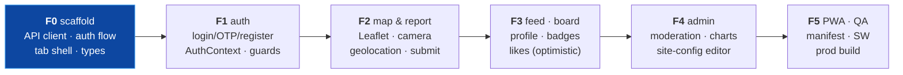

# Frontend Milestones F0–F5

**Branch:** `frontend` · **Companion:** `frontend_plan.md` (architecture & design)
**GitHub issues:** #16–#21

> Preview in VS Code (`Cmd+Shift+V`) for the diagram.

## Progress

| Milestone | Status | Issue |
|---|---|---|
| **F0** Scaffold & foundations | ⬜ next | #16 |
| **F1** Auth & app shell | ⬜ planned | #17 |
| **F2** Map & report submission | ⬜ planned | #18, #19 |
| **F3** Feed, leaderboard, profile & badges | ⬜ planned | (general) |
| **F4** Admin dashboard | ⬜ planned | #20 |
| **F5** PWA polish, QA & release | ⬜ planned | #21 |

---

## Dependency flow

Build order is UI-outward: the shell and auth first (everything sits inside them), then the
public map/report, then the data screens, then admin, then PWA hardening.

---

# F0 · Scaffold & foundations  (#16)

**Goal:** a running, installable-later app skeleton with the API client and auth flow proven.

### Tasks
| # | Task |
|---|---|
| 1 | `npm create vite` (React + TS) under `frontend/`; Node 22 |
| 2 | Tailwind v4 + shadcn/ui init (`components.json`, base tokens, dark mode) |
| 3 | Install: `@tanstack/react-query`, `react-router-dom`, `axios`, `react-hook-form`, `zod`, `react-leaflet leaflet`, `recharts`, `vite-plugin-pwa`, `lucide-react`, `date-fns` |
| 4 | `vite.config.ts`: `/api` proxy → `localhost:8000`; PWA plugin (dev-friendly) |
| 5 | `src/lib/api.ts` — Axios instance + **request/refresh interceptors** (§5 of plan), with the concurrent-401 queue |
| 6 | `src/lib/queryClient.ts` — QueryClient + defaults; `main.tsx` providers |
| 7 | `src/types/**` — API contract types mirroring the serializers |
| 8 | `src/services/**` — typed API functions (auth, posts, engagement, scoring, content, admin) |
| 9 | `src/components/layout/` — `PhoneFrame`, `AppShell`, `BottomNav`, `TopBar` (static) |
| 10 | Route tree in `App.tsx`: tab shell routes + placeholders; `site-config` fetched on boot |
| 11 | ESLint + Prettier; `npm run build` clean |

### Exit criteria
- [ ] `npm run dev` serves the app; bottom tab bar navigates between placeholder screens
- [ ] `npm run build` is clean; TypeScript strict passes
- [ ] Axios instance attaches the token and refreshes on a simulated 401
- [ ] Site-config loads on boot (site name/logo/map center available to the app)
- [ ] Renders as a centered phone frame on desktop, full-screen on mobile

---

# F1 · Auth & app shell  (#17)

**Goal:** full auth flow and the real navigation shell with route guards.

### Tasks
| # | Task |
|---|---|
| 1 | `AuthContext` — in-memory access token, current user, `login`/`logout`/`refreshOnBoot` |
| 2 | `useAuth` hook |
| 3 | Auth pages (full-screen, outside the tab shell): **Login, Register, OTP Verify, Forgot/Reset Password** |
| 4 | Forms with react-hook-form + zod; map API error envelope → field/toast messages |
| 5 | `ProtectedRoute` — redirects anonymous users from `/me` etc. to login |
| 6 | Wire the real BottomNav + TopBar; active-tab state; More menu (with Admin entry for staff) |
| 7 | Toast system (shadcn) for success/error |
| 8 | Boot sequence: refresh → hydrate user → render |

### Exit criteria
- [ ] Register → receive OTP (dev console) → verify → login works end to end
- [ ] Access token held in memory; refresh cookie set; reload keeps the session
- [ ] Logout revokes and returns to a signed-out state
- [ ] `/me` redirects to login when signed out; returns after login
- [ ] Wrong-password / expired-OTP errors show cleanly from the API envelope

---

# F2 · Map & report submission  (#18, #19)

**Goal:** the core loop — see reports on a map, file a new one with photo + location.

### Tasks
| # | Task |
|---|---|
| 1 | Home: `react-leaflet` map centered on site-config's map center/zoom |
| 2 | Load `GET /api/map/posts/`; severity-colored markers; marker → bottom-sheet detail |
| 3 | `useInfiniteQuery` feed of approved posts under/beside the map |
| 4 | Report flow (FAB → full screen): **camera capture** (getUserMedia / `react-webcam`) with gallery fallback |
| 5 | **HTML5 Geolocation** for lat/lon; manual pin-adjust on a mini map |
| 6 | Form (severity, description, + name/email/phone when anonymous) — rhf + zod |
| 7 | Base64-encode the photo; `POST /api/posts/`; success sheet + invalidate map/feed |
| 8 | Anonymous vs authenticated: hide contact fields when logged in (backend uses the profile) |
| 9 | Permission/error states: camera denied, geolocation denied, offline |

### Exit criteria
- [ ] Map shows approved markers; tapping one opens details with photo
- [ ] A user can capture a photo, get their location, and submit — anonymously or signed in
- [ ] Submitted report appears once approved; pending is not publicly visible
- [ ] Graceful handling when camera or location permission is denied

---

# F3 · Feed, leaderboard, profile & badges  (general)

**Goal:** the engagement and gamification surfaces.

### Tasks
| # | Task |
|---|---|
| 1 | Leaderboard screen with period tabs (all/year/month/week); rank list; your row highlighted |
| 2 | Like/unlike on posts — **optimistic** via React Query mutation |
| 3 | `Me` profile: level ring (points → next level), contribution stats |
| 4 | Badges grid from `GET /api/me/badges/` (earned vs locked, icons) |
| 5 | My Reports list (`/api/me/posts/`) with status chips (pending/approved/hidden) |
| 6 | Edit own report description |
| 7 | Empty/loading skeletons throughout |

### Exit criteria
- [ ] Leaderboard reflects points and switches periods
- [ ] Liking updates instantly and reconciles with the server
- [ ] Profile shows level, points-to-next, and earned badges
- [ ] My Reports shows correct statuses

---

# F4 · Admin dashboard  (#20)

**Goal:** moderation and configuration from the same mobile app (staff only).

### Tasks
| # | Task |
|---|---|
| 1 | Admin section under More → Admin, guarded by role (staff/admin) |
| 2 | Review queue: pending reports with full detail (admin serializer — contact info visible) |
| 3 | Approve / reject / hide / unhide actions with confirm sheets; optimistic queue removal |
| 4 | Stats dashboard: status counts + Recharts (approved vs pending, weekly trend) |
| 5 | Contact messages list + mark read/replied; feedback list |
| 6 | **Site-config editor**: week start, site name, tagline, map center/zoom, flags, logo |
| 7 | (If logo upload endpoint exists) upload; else URL/ref field |
| 8 | Point/level/badge rules are edited in Django admin — link out, don't rebuild here |

### Exit criteria
- [ ] Non-staff can't reach admin (guarded client + enforced server-side)
- [ ] Approve/reject/hide/unhide work and update the queue and stats
- [ ] Charts render real counts
- [ ] Site-config edits persist and reflect on the public app (name/logo/map)

---

# F5 · PWA polish, QA & release  (#21)

**Goal:** installable, tested, production-built, served by Django.

### Tasks
| # | Task |
|---|---|
| 1 | PWA manifest: name, colors, `standalone`, maskable icons (192/512), portrait |
| 2 | Service worker: precache shell, network-first API, offline fallback screen |
| 3 | Installability audit (Lighthouse PWA); "Add to Home Screen" works on iOS/Android |
| 4 | Responsive/QA pass on real device sizes; safe-area insets verified |
| 5 | Accessibility pass: tap targets, focus, contrast, labels |
| 6 | `npm run build` → `frontend/dist`; verify Django/Whitenoise serves it + deep links (SPA catch-all) |
| 7 | End-to-end smoke: full anonymous report, full auth loop, admin approve, leaderboard update |
| 8 | Error boundary + a friendly offline/500 screen |

### Exit criteria
- [ ] Lighthouse: installable PWA, good mobile performance
- [ ] Installs to home screen and launches full-screen
- [ ] `dist` served by Django same-origin; refresh/deep-links work; cookie auth works end to end
- [ ] Full loop green on a phone-sized viewport

---

## Cross-cutting (every milestone)
- Mobile-first: no horizontal scroll, 44px targets, safe areas.
- Types mirror the API; components use hooks, never Axios directly.
- Loading = skeletons; errors = the API envelope surfaced as toasts/field errors.
- Light/dark both work.

## What's deferred (not in F0–F5)
- Comments UI (backend deferred to v2).
- Referrals.
- Push notifications / background sync.
- Full offline report drafting.
