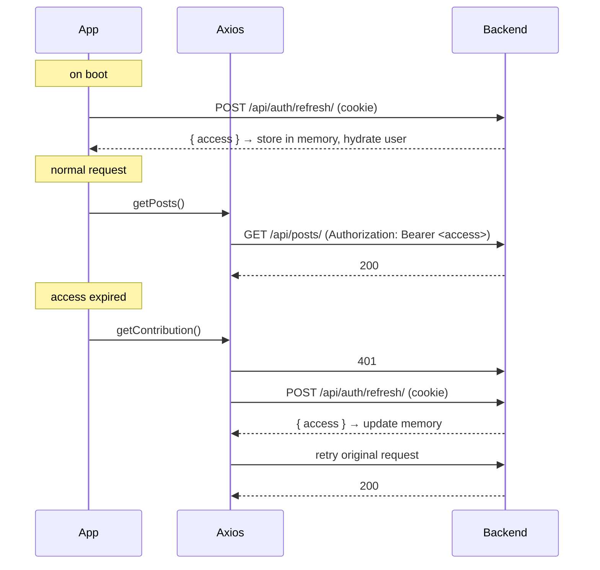

# Frontend Plan - PlasticKothay PWA

**Branch:** `frontend` · **Status:** plan (pre-implementation)
**Consumes:** the backend API on `backend` (31 endpoints, contract-complete)
**Companion:** `frontend_milestones_f0_f5.md` (task-level breakdown)

---

## 1. What we're building

A **mobile-first Progressive Web App** that looks and feels like a native phone app -
installable to the home screen, full-screen, with a **bottom tab bar** for primary navigation
and bottom sheets for actions. Desktop renders the same app centered in a phone-width frame.
Mobile UX is the primary target; desktop is a courtesy.

Users: report plastic-pollution sightings (with a photo + location), browse them on a map,
like reports, climb a leaderboard, and earn badges. Admins moderate from the same app.

---

## 2. Stack (final)

| Concern | Choice | Notes |
|---|---|---|
| Runtime | **Node 22 LTS** | current LTS; upgrade from local 18 (EOL). Use `nvm`/`fnm`. |
| Build | **Vite 7** + TypeScript 5 | |
| UI | **React 19** | |
| Routing | **React Router 7** | |
| Styling | **Tailwind CSS v4** + **shadcn/ui** | CSS-first config; components live in our repo |
| Server state | **TanStack Query v5** | caching, refetch, optimistic updates for likes |
| Client state | **React Context** | auth only |
| Forms | **react-hook-form + zod** | zod schemas mirror the API contract |
| HTTP | **Axios** | one instance with the token/refresh interceptors |
| Map | **react-leaflet v5** + Leaflet | |
| Charts | **Recharts** | admin dashboard |
| PWA | **vite-plugin-pwa** (Workbox) | manifest + service worker + installability |
| Icons | **lucide-react** | ships with shadcn |
| Dates | **date-fns** | lightweight |

> Versions are pinned at scaffold time and compatibility verified (React 19 + Tailwind v4 +
> shadcn + react-leaflet v5 all support each other as of this plan).

---

## 3. Mobile-app design system

### 3.1 The frame
- **Mobile:** full-viewport, `100dvh`, no horizontal scroll ever.
- **Desktop:** the app is centered at `max-width: 480px` with a subtle frame/shadow - it reads
  as a phone. Content never sprawls wide.
- **Safe areas:** honour `env(safe-area-inset-*)` so the bottom bar clears the iPhone home
  indicator and content clears the notch.

### 3.2 Navigation - bottom tab bar
Fixed to the bottom, five slots, the center one a raised **FAB** for the primary action:

```
┌─────────────────────────────────────────┐
│              (screen content)            │
│                                          │
├──────────────────────────────────────────┤
│   🗺️        🏆        ➕        🎖️      ☰   │
│  Home     Board    Report     Me      More │
└──────────────────────────────────────────┘
```

| Tab | Route | Screen |
|---|---|---|
| **Home** | `/` | Leaflet map of approved reports + nearby feed |
| **Board** | `/leaderboard` | leaderboard (all/year/month/week tabs) |
| **Report** (FAB) | `/report` | camera + geolocation + submit flow (bottom sheet or full screen) |
| **Me** | `/me` | profile: contribution, level ring, badges, my reports |
| **More** | `/more` | contact, feedback, about, settings; **Admin** entry for staff; logout |

- **Top app bar:** contextual - screen title, optional back button, optional action.
- **Sheets, not modals:** actions (report details, filters, confirm) slide up from the bottom
  (shadcn `Sheet`/`Drawer`), the native-app pattern.
- **Auth screens** (login/register/OTP) are full-screen flows *outside* the tab shell.
- **Admin** lives under More → Admin as its own stack, still mobile-first.

### 3.3 Theming
shadcn CSS-variable tokens; light + dark via `prefers-color-scheme` and a manual toggle. A
green-forward brand palette (environmental). Site name, logo, and colors read from
`GET /api/site-config/` on boot, so branding is admin-controlled.

### 3.4 Touch & feel
Minimum 44px tap targets, momentum scrolling, skeleton loaders (not spinners) while queries
load, optimistic like button, pull-to-refresh on feeds where it helps.

---

## 4. Folder structure

```
frontend/
├── public/                    icons, manifest assets, offline fallback
├── index.html
├── vite.config.ts             + PWA plugin + /api proxy to :8000
├── tailwind.config / css      Tailwind v4 (CSS-first)
├── components.json            shadcn config
├── tsconfig.json
├── package.json
└── src/
    ├── main.tsx               bootstrap: QueryClientProvider, AuthProvider, Router
    ├── App.tsx                route tree (tab shell + auth stack + admin stack)
    ├── index.css              Tailwind + design tokens
    ├── lib/
    │   ├── api.ts             Axios instance + request/refresh interceptors
    │   ├── queryClient.ts     TanStack Query config + keys
    │   └── utils.ts           cn() and helpers (shadcn)
    ├── types/                 API contract types (mirror the serializers)
    │   ├── auth.ts  post.ts  scoring.ts  content.ts  config.ts
    ├── services/              one module per API area - pure functions returning typed data
    │   ├── authService.ts  postService.ts  engagementService.ts
    │   ├── scoringService.ts  contentService.ts  adminService.ts
    ├── hooks/                 React Query wrappers + useAuth
    │   ├── usePosts.ts  useLeaderboard.ts  useContribution.ts  useLikePost.ts ...
    ├── context/               AuthContext (token + user + login/logout)
    ├── components/
    │   ├── ui/                shadcn components (owned)
    │   ├── layout/            AppShell, BottomNav, TopBar, PhoneFrame, ProtectedRoute
    │   ├── map/  report/  feed/  leaderboard/  profile/  admin/
    ├── pages/                 one component per route
    └── assets/
```

**Layering (light discipline, echoing the backend):** `services` (HTTP) → `hooks` (React Query)
→ `pages`/`components` (UI). Components never call Axios directly; they use hooks. Types mirror
the API contract so a backend change surfaces as a type error.

---

## 5. Auth token flow (the careful part)

Matches the backend exactly (httpOnly refresh cookie + in-memory access token).



Rules:
- **Access token in a module variable (memory), never localStorage** - XSS can't read it.
- **Refresh token** is the backend's httpOnly cookie; the browser sends it automatically.
- **Request interceptor** attaches `Authorization: Bearer <access>` when present.
- **Response interceptor** on `401`: call `/api/auth/refresh/` once, update the token, retry the
  original request. **Concurrent 401s queue** behind a single in-flight refresh, then all retry.
- **Refresh fails** → clear auth, redirect to login.
- **Boot:** call refresh once so a page reload restores the session (memory was wiped).
- **Logout:** `POST /api/auth/logout/` (revokes + clears cookie) then drop the in-memory token.
- **Dev:** Vite proxies `/api` → `localhost:8000`, so the cookie is same-origin. **Prod:** Django
  serves the build, same-origin. No CORS either way.

---

## 6. Server state - TanStack Query

- One `QueryClient`; sensible defaults (`staleTime` per data type, retry off for 4xx).
- **Query keys** are structured and centralized: `['posts', filters]`, `['map']`,
  `['leaderboard', period]`, `['contribution']`, `['badges']`, `['siteConfig']`,
  `['admin','reviewQueue', status]`.
- **Mutations** invalidate the right keys: submit report → invalidate map + feed; approve/reject
  → invalidate the review queue + stats.
- **Optimistic** like/unlike: bump the count immediately, roll back on error.
- **Cursor pagination** (the backend's `next_cursor`) via `useInfiniteQuery`.
- **Auth stays in Context**, not React Query - it's client state, not server cache.

---

## 7. PWA

- **`vite-plugin-pwa`** generates the service worker (Workbox) and wires registration.
- **Manifest:** name, short_name, theme/background color, `display: standalone`, maskable icons
  (192/512), portrait orientation → installable "Add to Home Screen", no browser chrome.
- **Caching:** precache the app shell (HTML/JS/CSS); API calls are network-first (React Query
  owns in-session caching). A simple offline fallback screen when the shell can't reach the net.
- **Icons/splash:** generated from one source logo.
- Not doing background sync / push in v1 - noted as future.

---

## 8. TypeScript API contract

`src/types/` hand-mirrors the backend serializers (one file per area). Every service returns
these types, so the UI is typed end-to-end and a contract drift shows up at compile time.
Example shapes: `PublicPost`, `MapMarker`, `LeaderboardRow`, `Contribution`, `EarnedBadge`,
`SiteConfig`, `AuthUser`, `TokenResponse`. (Kept in sync by hand; a future option is generating
from an OpenAPI schema if we add drf-spectacular.)

---

## 9. Decision log

| # | Decision | Why |
|---|---|---|
| F-1 | Mobile-first PWA, bottom-tab shell, phone-frame on desktop | product direction - feels like a native app, installable |
| F-2 | Tailwind v4 + shadcn/ui | own the components, no bloat, fits custom public + data-heavy admin |
| F-3 | TanStack Query for all server state; Context for auth only | caching/refetch/optimistic for free; the modern standard |
| F-4 | react-hook-form + zod | robust forms; zod mirrors the API contract |
| F-5 | Node 22 LTS, latest Vite/React | current, supported; local Node 18 is EOL |
| F-6 | Access token in memory, refresh via httpOnly cookie | XSS-safe; matches backend DEC-7 |
| F-7 | Same-origin (Vite proxy in dev, Whitenoise in prod) | cookie stays first-party, no CORS |
| F-8 | Types hand-mirrored from the API | end-to-end typing without adding a codegen pipeline yet |

---

## 10. Open questions before/along the way

1. **Brand palette & logo** - a starting green palette is fine; final logo comes via site-config.
2. **Map tiles** - OpenStreetMap default tiles (free) vs a keyed provider (MapTiler/Mapbox) for
   nicer styling. OSM to start.
3. **Anonymous reporting UX** - the API allows it; do we surface a "report without an account"
   path, or nudge sign-up first? (Recommend allow-anonymous with a soft sign-up nudge.)
4. **Offline depth** - v1 caches the shell only. Full offline report drafting is a later add.
