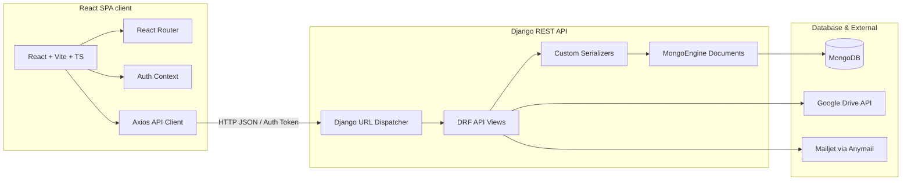
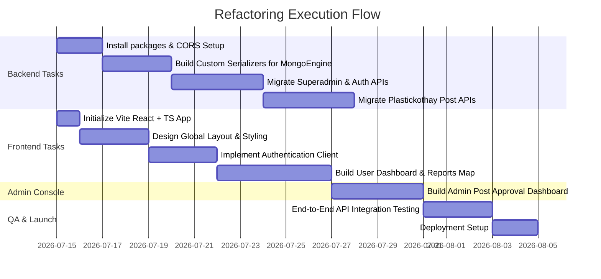

# Refactoring Plan: Decoupling Django to Django REST Framework (DRF) + React (Vite & TypeScript)

This document provides a comprehensive technical guide for refactoring the **PlasticKothay** project. The goal is to separate the existing Django backend (which uses MongoDB via `mongoengine` and renders server-side templates) into a decoupled architecture: a RESTful API backend using Django REST Framework (DRF) and a Single Page Application (SPA) frontend built with React, Vite, and TypeScript.

---

## 1. Architectural Overview

### Current Monolithic Architecture
- **Backend:** Django 5.2 handling URL routing, custom session-based authentication, MongoDB data access via `mongoengine`, and template rendering.
- **Frontend:** Server-side rendered Django HTML templates (`templates/plastickothay/` and `templates/superadmin/`), using jQuery/Vanilla JavaScript for AJAX requests and DOM manipulation.
- **Database:** MongoDB configured using connection settings in `settings.py` and maps models via `mongoengine.Document`.

### Target Decoupled Architecture


---

## 2. Backend Refactoring (Django & DRF)

### 2.1 Dependency Updates
To support DRF, CORS, and modern API standards with MongoDB, update `backend/requirements.txt` to include:
- `djangorestframework`: For creating RESTful endpoints.
- `django-cors-headers`: For handling Cross-Origin Resource Sharing (CORS) between React and Django.
- `pyjwt` or `django-rest-framework-simplejwt` (adapted for custom auth if token authentication is preferred).

### 2.2 Serializers for MongoEngine Documents
Because MongoEngine documents are not standard Django models, DRF’s `ModelSerializer` cannot be used directly. Instead, we have two options:
1. Use the community package `django-rest-framework-mongoengine` (may require version compatibility checks).
2. **(Recommended)** Write explicit, custom DRF `serializers.Serializer` classes. This provides full control over data validation, formatting (like MongoDB `ObjectId` conversion), and limits package-bloat.

#### Example: `PostSerializer` (`backend/plastickothay/serializers.py`)
```python
from rest_framework import serializers
from bson import ObjectId
from plastickothay.models import Post

class ObjectIdField(serializers.Field):
    """Serializer field for MongoDB ObjectId."""
    def to_representation(self, value):
        return str(value)

    def to_internal_value(self, data):
        try:
            return ObjectId(data)
        except Exception:
            raise serializers.ValidationError("Invalid ObjectId format.")

class PostSerializer(serializers.Serializer):
    id = ObjectIdField(read_only=True)
    name = serializers.CharField(max_length=255)
    email = serializers.EmailField()
    pN = serializers.CharField(max_length=20)  # Phone number
    severity = serializers.IntegerField(min_value=1, max_value=5)
    imageID = serializers.CharField(max_length=255)
    lat = serializers.FloatField()
    lon = serializers.FloatField()
    description = serializers.CharField(default="No description provided.", allow_blank=True)
    status = serializers.IntegerField(default=2)  # 0 = rejected, 1 = accepted, 2 = pending
    created = serializers.DateTimeField(read_only=True)

    def create(self, validated_data):
        return Post.objects.create(**validated_data)

    def update(self, instance, validated_data):
        for attr, value in validated_data.items():
            setattr(instance, attr, value)
        instance.save()
        return instance
```

### 2.3 Refactoring Django Views to DRF API Views
We will convert traditional Django template-rendering views into DRF class-based `APIView`s or function-based views using `@api_view`.

#### Example: Refactored `posts` and `home` Views (`backend/plastickothay/api_views.py`)
```python
from rest_framework.views import APIView
from rest_framework.response import Response
from rest_framework import status
from rest_framework.permissions import AllowAny, IsAuthenticated
from .models import Post
from .serializers import PostSerializer
from datetime import datetime, timedelta

class PostListAPIView(APIView):
    permission_classes = [AllowAny]

    def get(self, request):
        filter_type = request.query_params.get('filter', 'all')
        now = datetime.now()
        
        # Filtering logic mapped directly from original views
        if filter_type == 'today':
            start = datetime(now.year, now.month, now.day)
            posts = Post.objects(created__gte=start)
        elif filter_type == 'last_week':
            start = now - timedelta(days=7)
            posts = Post.objects(created__gte=start)
        elif filter_type == 'last_28_days':
            start = now - timedelta(days=28)
            posts = Post.objects(created__gte=start)
        elif filter_type.startswith('severity_'):
            try:
                sev = int(filter_type.split('_')[1])
                posts = Post.objects(severity=sev)
            except ValueError:
                posts = Post.objects()
        elif filter_type == 'accepted':
            posts = Post.objects(status=1)
        elif filter_type == 'pending':
            posts = Post.objects(status=2)
        else:
            posts = Post.objects()

        # Sort and return serialized list
        posts = posts.order_by('-created')
        serializer = PostSerializer(posts, many=True)
        return Response(serializer.data, status=status.HTTP_200_OK)

    def post(self, request):
        # Base64 photo processing and Google Drive upload logic
        # returns serialized new post
        serializer = PostSerializer(data=request.data)
        if serializer.is_valid():
            # TODO: Extract base64 image data, call upload_to_drive, and assign imageID
            # save post document:
            post = serializer.save()
            return Response(PostSerializer(post).data, status=status.HTTP_201_CREATED)
        return Response(serializer.errors, status=status.HTTP_400_BAD_REQUEST)
```

### 2.4 Authentication Refactoring
The current architecture uses custom cookie/session authentication:
`request.session['user_id'] = str(user.id)` with the `MongoBackend` auth driver.

For the React + DRF setup, we will configure **JWT (JSON Web Token) Authentication** or **Token Authentication**.
Because standard DRF JWT tokens lookup Django relational SQL database models, we will write a lightweight Custom JWT Authentication Class that validates JWT tokens and queries the `User` document from MongoDB via `mongoengine`.

#### Custom DRF Authentication Backend (`backend/superadmin/authentication.py`)
```python
import jwt
from django.conf import settings
from rest_framework import authentication, exceptions
from bson import ObjectId
from superadmin.models import User

class MongoJWTAuthentication(authentication.BaseAuthentication):
    def authenticate(self, request):
        auth_header = request.headers.get('Authorization')
        if not auth_header:
            return None

        try:
            token_type, token = auth_header.split(' ')
            if token_type.lower() != 'bearer':
                return None
            
            payload = jwt.decode(token, settings.SECRET_KEY, algorithms=['HS256'])
            user_id = payload.get('user_id')
            
            user = User.objects.get(pk=ObjectId(user_id))
            if not user.is_active:
                raise exceptions.AuthenticationFailed('User is inactive.')
                
            return (user, None)
        except (jwt.ExpiredSignatureError, jwt.InvalidTokenError, User.DoesNotExist):
            raise exceptions.AuthenticationFailed('Invalid or expired authentication token.')
```

### 2.5 CORS and API Configuration (`settings.py`)
Add CORS headers middleware and settings:
```python
INSTALLED_APPS += [
    'corsheaders',
    'rest_framework',
]

MIDDLEWARE = [
    'corsheaders.middleware.CorsMiddleware',
    # ... other middlewares
]

CORS_ALLOWED_ORIGINS = [
    "http://localhost:5173",  # React default dev server port
]

REST_FRAMEWORK = {
    'DEFAULT_AUTHENTICATION_CLASSES': [
        'superadmin.authentication.MongoJWTAuthentication',
        'rest_framework.authentication.SessionAuthentication', # Optional fallback
    ],
    'DEFAULT_PERMISSION_CLASSES': [
        'rest_framework.permissions.IsAuthenticated',
    ]
}
```

---

## 3. Frontend Architecture (React)

The frontend will be initialized under `/frontend` using **Vite** and **TypeScript**.

### 3.1 Directory Structure Plan
```text
frontend/
├── public/
├── src/
│   ├── assets/             # Images, Global Styles, SVGs
│   ├── components/         # Reusable Components (Navbar, Button, Map, Input)
│   ├── context/            # AuthContext, ThemeContext
│   ├── hooks/              # Custom Hooks (useAuth, useFetch)
│   ├── layouts/            # DashboardLayout, MainLayout
│   ├── pages/              # Router Pages (Home, Login, Register, Dashboard, Contribution)
│   ├── services/           # Axios Client and API endpoints
│   │   ├── api.ts          # Axios Interceptors & Base Configurations
│   │   ├── authService.ts  # login, logout, verification
│   │   └── postService.ts  # createPost, getPosts, updatePost
│   ├── types/              # TypeScript interface definitions (User, Post, OTP)
│   ├── App.tsx             # Route Configuration
│   ├── index.css           # Tailwind/Vanilla CSS configurations
│   └── main.tsx            # App bootstrapping
├── package.json
├── tsconfig.json
└── vite.config.ts
```

### 3.2 State & Authentication Flow
- **Context API (`AuthContext`):** Will wrap the React application, storing the user token and user profile details.
- **Axios Interceptor:** Automatically appends the Bearer token (`Authorization: Bearer <token>`) to outbound requests and handles `401 Unauthorized` token refreshing or redirection to the login page.
- **Protected Routes:** A wrapper component (`ProtectedRoute.tsx`) will shield pages like the Dashboard, User Profiles, and Contribution page from unauthenticated users.

---

## 4. Step-by-Step Refactoring Workflow



### Phase 1: Setup and CORS Configuration
1. Install `djangorestframework`, `django-cors-headers`, and `pyjwt` on Python environment.
2. Update settings to allow CORS and register DRF config.

### Phase 2: Serializers and Auth Endpoints
1. Create `serializers.py` in both `superadmin` and `plastickothay`.
2. Write Serializer classes for `User`, `OTP`, `Post`, and `Rate`.
3. Create Auth endpoints (`/api/auth/register/`, `/api/auth/verify/`, `/api/auth/login/`, `/api/auth/logout/`) in `superadmin/api_views.py`. Ensure we handle password hashing using Django check/make password utilities.

### Phase 3: Post & User Endpoints
1. Create Post endpoints (`/api/posts/` list & create, `/api/posts/<id>/` get & update, `/api/posts/contribution/` metrics).
2. Adapt Google Drive uploading utility to work with base64 data payloads sent from the React client.
3. Migrate the admin review endpoints (`/api/admin/accept/<id>`, `/api/admin/reject/<id>`).

### Phase 4: Frontend Development
1. Bootstrap Vite + TypeScript project in the `frontend` folder.
2. Establish Global Layouts, Routes, and Tailwind CSS/Vanilla CSS styling.
3. Code Auth page components: Login, Signup, OTP Verify, and Reset Password.
4. Implement Dashboard pages: Map plotting of plastic issues using Leaflet maps, custom markers, and forms to submit post reports (capturing webcam photo input and base64-encoding it for Google Drive).
5. Build Admin Dashboard with dynamic graphs (replacing Django's Chart.js setup with React-compatible charting libraries like Recharts or Chart.js wrapped for React).

### Phase 5: Verification & Integration Testing
1. Execute End-to-End manual testing of API connections.
2. Confirm Google Drive and Mailjet integration are fully functional.
3. Standardize deployment configurations (e.g., configuring Whitenoise to host the compiled React `dist/` directory, or configuring reverse proxies on Render/VPS).
